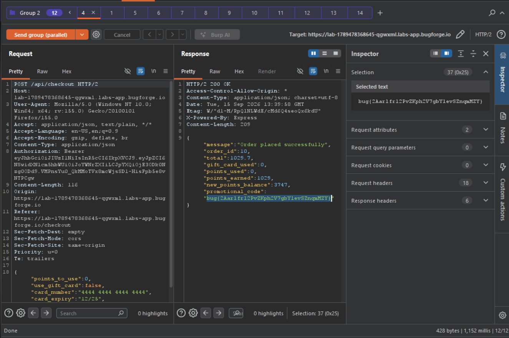

Daily challenge.
Hint: *Can you checkout with more items than you initially added to your basket?*

I went through an app, and I noticed two endpoints worth checking in this scenario. First one is the `POST` request to `/api/cart`, which allows to add new items to the cart, and the second, the `POST` request to the `/api/checkout` which is a payment endpoint.
In order to solve this lab I needed to add, those two request to the Burp's Repeater, I grouped them, I duplicated `/api/cart` request 10 times, and I sent those in `group (parallel)`. The vulnerability in this lab is business logic flaw, combined with race condition, allowing an attacker to add additional items into the basket.

