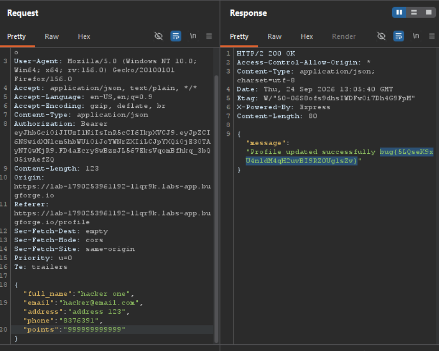

Daily challenge.
Hint: *Time to update your profile.*

When updating a profile, I send a `POST` request to the `/api/profile` endpoint.
The request has keys in JSON body such as: `full_name`, `email`, `address`, and `phone`. The additional things such as: `role` and `points` are visible on the webpage. I tried to add extra key-values inside JSON body, the `role` key set to `admin` doesn't work. On the other hand, when I added `points` and set it's value to a number, the response contains the flag.

