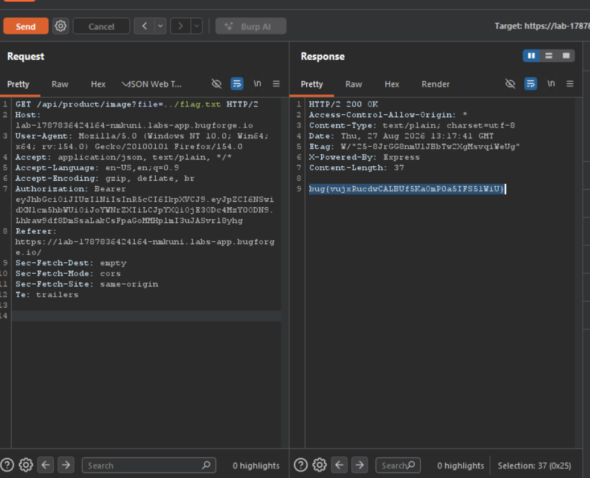

Daily challenge.
Hint: *File Inclusion.*

After registering an account and logging in, I checked the Burp for captured traffic and I noticed that every request to `/api/product/image?file=` has a file path in it for fetching products images. So this is most likely my entry point.

The working payload for reading `file.txt` is `/api/product/image?file=../flag.txt`.

