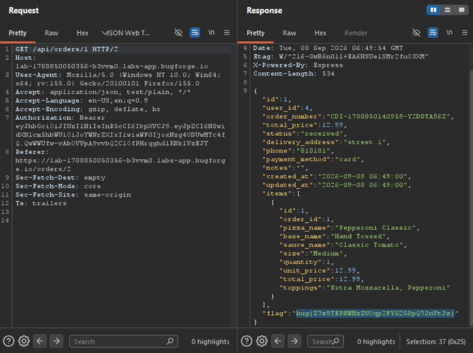

Daily challenge.
Hint: *IDOR. Can you view things that don't belong to you?*

The IDOR vulnerability in this challenge is located in `/api/orders/*` endpoint.
To solve the challenge, I needed to create two accounts, make an order on one of them, and finally access order details on a second account.

