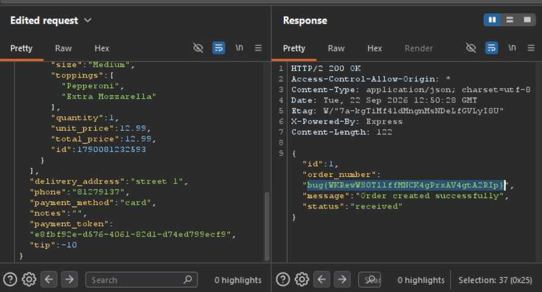

Daily challenge.
Hint: *Can you tamper with the price via the tip feature?*

After creating an account and putting a pizza into cart, I turned on Interception in Burp Suite. Going through the whole process of ordering a pizza, step by step, I spotted that there are two `POST` requests that contains `tip` key in JSON body:
- First one, `/api/payment/validate`
- The second one, `/api/orders`
In both of them, I edited value of the `tip` to `-10`, and after sending second request, I spotted flag in the `order_number`.

