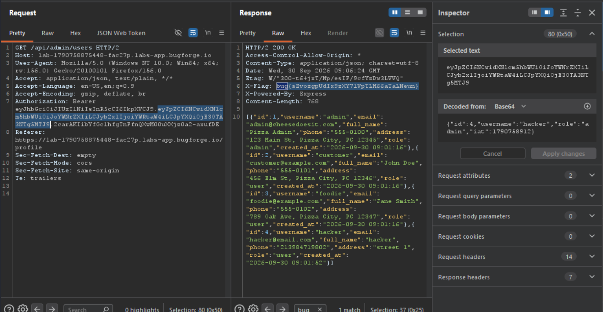

Daily challenge.
Hint: *JWT*

After registering an account, I sent `GET` request to `/api/verify-token` to Burp Repeater. I used *JSON Web Token* extension to find *HMAC secret*, which was `secret`. Then I forged a token, where I changed my role to admin, and I signed it, with new symmetric key I created using secret - `secret`. After I signed it, I accessed `/api/admin/users` endpoint. In the response I noticed a header - `X-Flag`, and there was the flag for this challenge.

