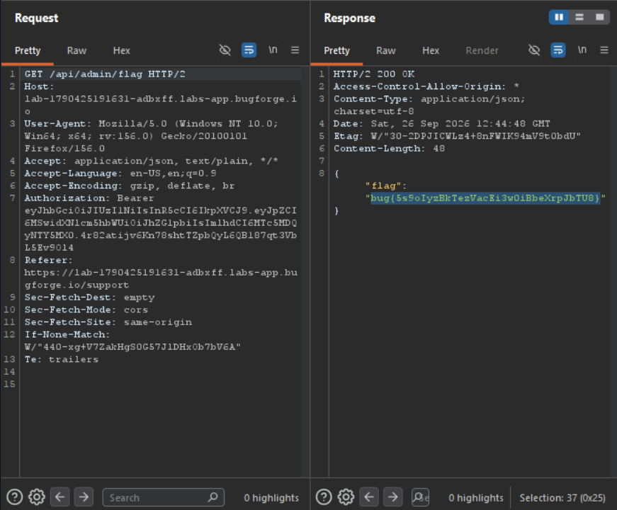

Daily challenge.
Hint: *Ask support.*

After registering an account, I went straight forward to the *support* feature, where you can send a message to the support.
I crafted XSS payload for cookie grabbing:
``
and I put it in the message field. After a moment I got a hit. I took base64 encoded cookie from webhook, and decoded it. Then I put it in the `Authorization` header in the Burp Repeater, and started exploring web app.
I found a hidden endpoint `/api/admin/flag`, when I sent a `GET` request to it, in the response I found a flag for this challenge.

