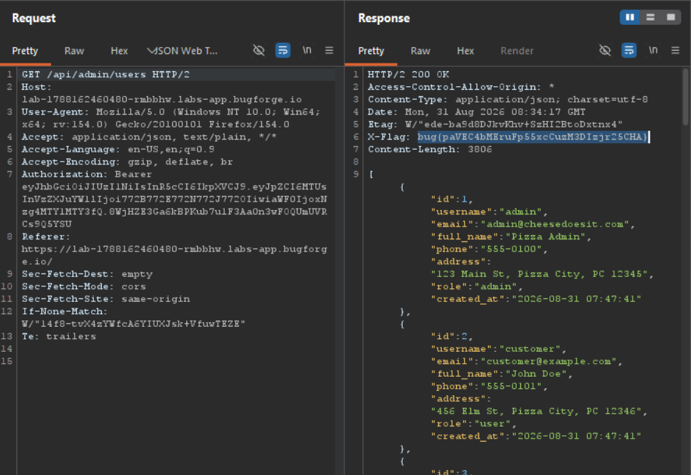

Daily challenge.
Hint: *Can you register as admin?*

I started on intercepting register request in Burp, and I tried to add to the json payload, the key-value pair of `"role":"admin"`, but it didn't worked.
Next, I sent the POST request to the `/api/registration` endpoint to Repeater and started playing around with it.
After many attempts, I decided to mess with old tricks and try to use cyrillic `\uff41\uff44\uff4d\uff49\uff4e`, 
I tried all combinations, but `/api/login` endpoint still shows that my role is set to user.
This is where it gets tricky. Despite the fact that I registered as a `ａｄｍｉｎ` not `admin`, and I don't have my role set to admin, I can access admin endpoints! So, I went straight into `/api/admin/users` endpoints, which is the most interesting one found in the js file, and there in the `X-FLAG` response header was a flag for this challenge.

