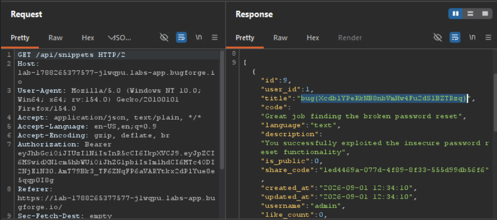

Daily challenge.
Hint: *Broken Access Control*

Broken Access Control is a web vulnerability when a web app fails to properly enforce user permissions. 
Now, I just need to find an endpoint where I can view something i shouldn't.
I went through an app, and I noticed that publicly available snippets lacks one with `id=4`, so I tried to access it.
I couldn't do it from the browser level, so I tried to identify a user who own snippet 4.
I found that user named `pythonista` owns missing snippet. From the `/api/profile/pythonista` i could read `share_code` of a snippet. But unfortunately it wasn't intended solution.
I took step back, and enumerate app further. I found an endpoint where I could change my password - `api/profile/password` which accepts two json key-pair values - password and user_id. 
I took this request to a Burp Repeater, and I changed `user_id` to `1` which is id of an admin account. The request was successfully accepted by a server, and I logged in into administrator account, where the flag was waiting.

