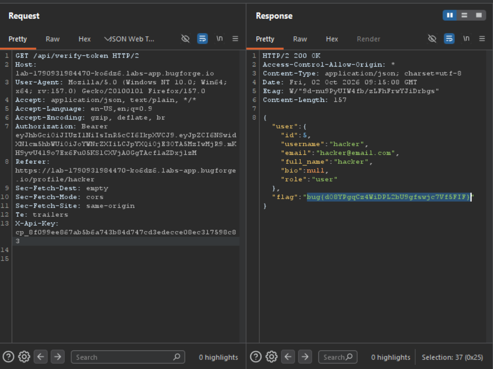

Daily challenge.
Hint: *What if Jeremy and Jessamy have the same token name?*

In order to solve this lab, you need to create two accounts, and create API Keys with the same name on both of them.
Then send `GET` request to `/api/verify-token` endpoint with first users `Authorization` header, and a `X-API-Key` header set to the second users API token.
In the response you'll see the flag.

