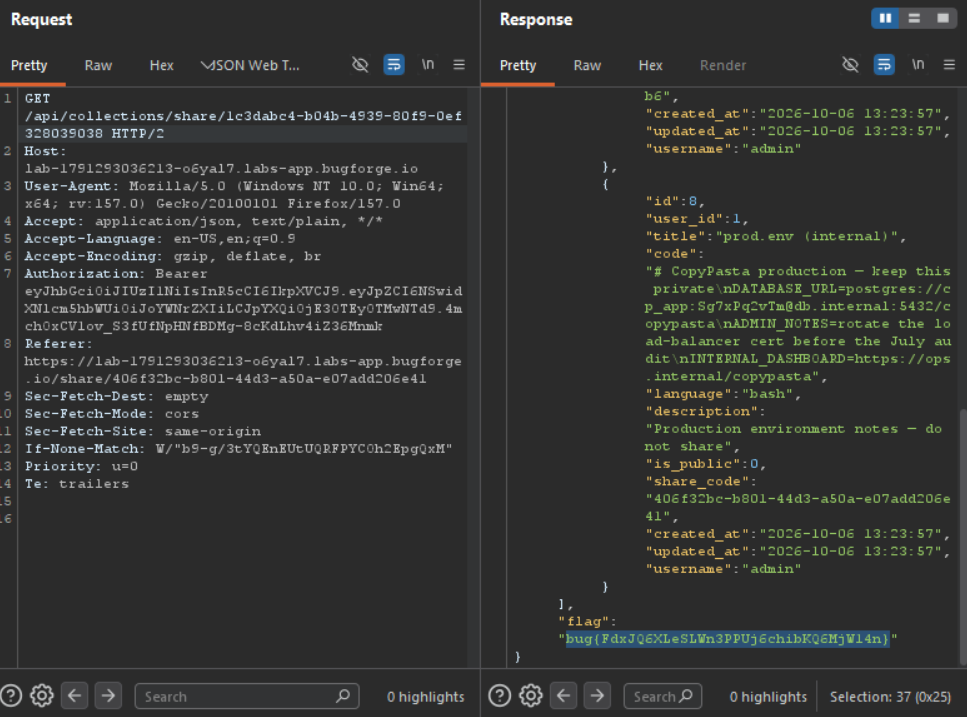

Daily challenge.
Hint: *Slugs are useful.*

In the webapp there is *collection* functionality, which allows user to add snippets into it.
Each collection has it's own *slug* which is identifiable number, like an id.
The `/api/collections/:id` endpoint has IDOR vulnerability, which allows to see other users collections, but only public ones with only public snippets. The collection with id 2, belongs to admin. After sending `GET` request to `/api/collections/2` in the response I saw *slug* of admin collection.
I used leaked *slug* on another endpoint: `/api/collections/share/:slug`, after sending `GET` request to it, I was able to leak, not only public, but also private snippets inside of it.
There is BOLA vulnerability, which allows user to see contents of private snippet, inside of public collection.

