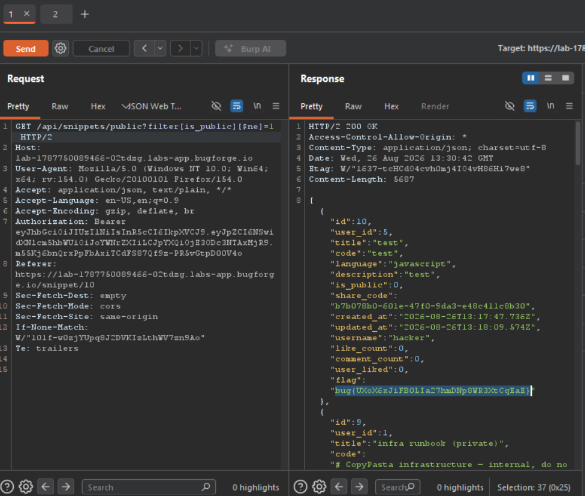

Daily Challenge.
Hint: *Read the snippets.*

There is a public snippet with notes how CopyPasta API works.
```
Quick notes for anyone scripting against our snippet search.

Basic:
  GET /api/snippets/public?search=<text>&language=<lang>

Advanced field filters (narrow the public list by a stored field):
  GET /api/snippets/public?filter[language]=python
  GET /api/snippets/public?filter[title]=Fetch API Helper

This endpoint only ever lists snippets that are marked public.
```

The vulnerable endpoint is `/api/snippets/public?filter`. The vulnerability which lies there is *query operator injection*. In order to get the flag, I sent a `GET` request with a payload: `/api/snippets/public?filter[is_public][$ne]=1`, which means that i want to query every snippet whose key value **NOT EQUAL** ($ne) 1. And in the response of this request I saw all not public snippets, and in the first one was the flag.

