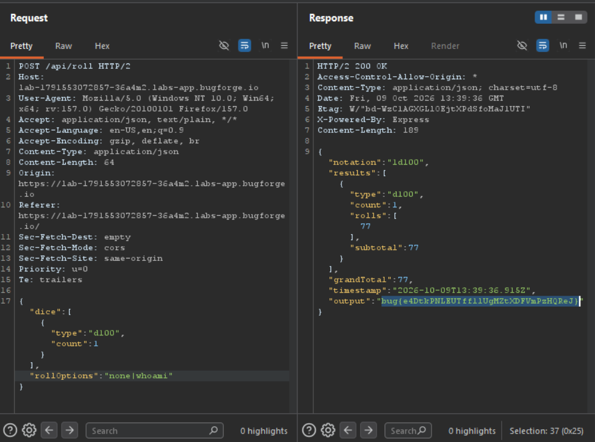

Daily challenge.
Hint: *RCE*

In the `POST` request to the `/api/roll` endpoint there is the JSON body. One of key is named `rollOptions` and has a `none` value. After adding `|whoami` to `none` value, I achieved RCE, and the flag came out in the response.

