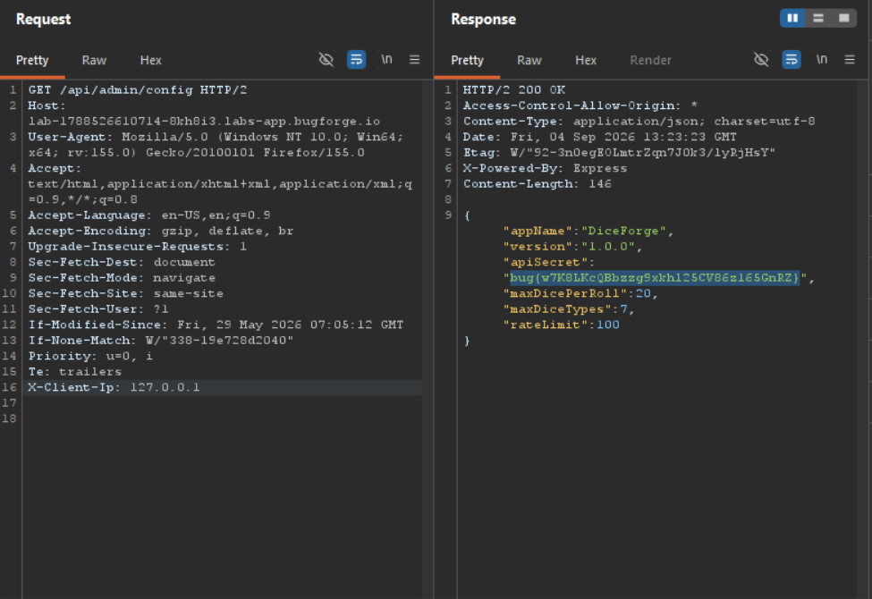

Daily challenge.
Hint: *Request headers.*

It's a simple web app, with a feature that allows to roll a dice.
I tried to enumerate more path in the `/api` path, and after sending a request to the `/api/admin`, the server responded with `"error":"Incomplete path"`. From there, I knew that there is some endpoint that I can reach. With further enumeration, I found `/api/admin/config`, but it gave me 403 Forbidden in the response.
Having in mind a hint for this lab, I tried some basic techniques that use request headers to bypass 403.
After some bruteforcing, I found the solution - `X-Client-Ip: 127.0.0.1`.

