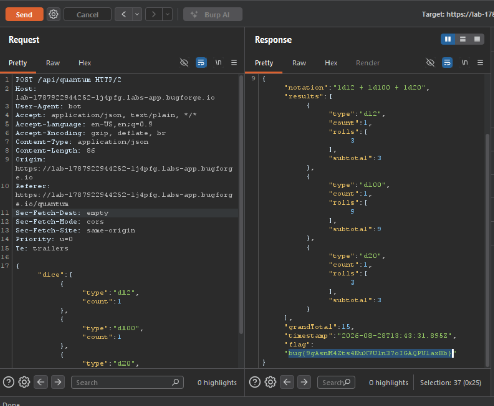

Daily challenge.
Hint: *There are some common "paywall bypass" techniques to explore.*

The feature in this lab which is behind a paywall is called *quantum*. First I opened Burp, and started to intercept traffic. After clicking on the *quantum* feature the second request that was intercepted was: `GET /api/subscriber-content`. I clicked on it to intercept response and forwarded it. In the intercepted response, I added `{"access":true}` payload and forwarded it. After doing so, I could see what was behind the paywall, but I couldn't use premium feature.
The vulnerable endpoint - `POST /api/quantum` - has `User-Agent` header, which after changed to a word with `bot` in it, is accepted by the server and the attacker can use premium feature.

