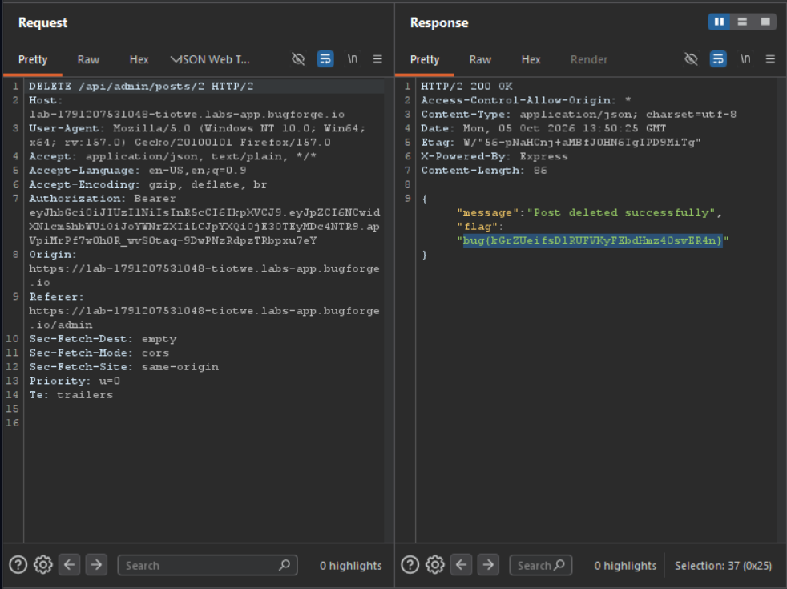

Daily challenge.
Hint: *Broken access control.*

I created an account and went through webapp functionalities. What caught my attention was *reporting posts* (flagging) functionality.
I flagged two of them, and logged in as an *admin* with provided credentials - `admin:admin123`. Then I deleted one of them, and approved the second.
I logged in on account I created earlier, and found *approving* and *deleting* requests in Burp Suite.
I sent two requests to Repeater, and I swapped the cookies so they were from the account I created.
I flagged two new posts, so I get their id's, and sent requests.
The `POST` request to `/api/admin/posts/6/approve` throws an error, because I needed admin access, but `DELETE` request to `/api/admin/posts/2` was accepted, and I was able to delete post successfully. In the response I got a flag.

