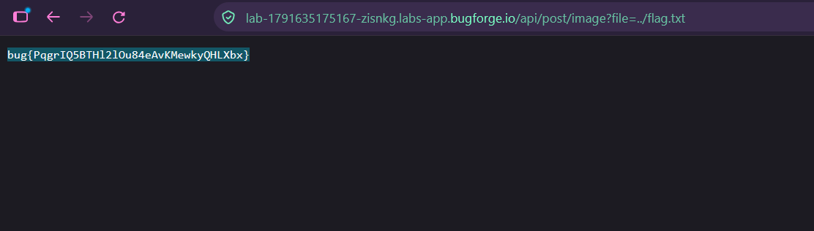

Daily challenge.
Hint: *File inclusion*

The vulnerable endpoint is accessible when clicking on user and then clicking on one of his image, and opening it in the new tab. The `GET` request to `/api/post/image?file=/uploads/otter3.png` is vulnerable to *File Inclusion* when changing value of parameter `?file=` to `../flag.txt`, the flag is accessed on the server and displayed in the browser.

