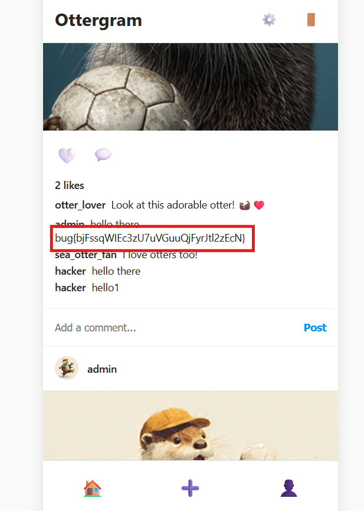

Daily challenge.
Hint: *Can you edit comments?*

After creating an account and posting first comment, I checked Burp's proxy, and I found that there is a `POST` request to the `/api/posts/1/comments` which creates a comment. In the response, my comment got his own `id` number.
So, I tried sending a `POST` request to the `/api/posts/1/comments/3`, but I got an error `Cannot POST /api/posts/1/comments/3`.
I changed method from `POST` to `PUT`, and I managed to update my own comment. 
But, can I update someone else's comment? I tried by changing id from 3 to 1. I sent `PUT` request to the `/api/posts/1/comments/1` and refreshed a webpage. And in the admin's edited comment was a flag.

