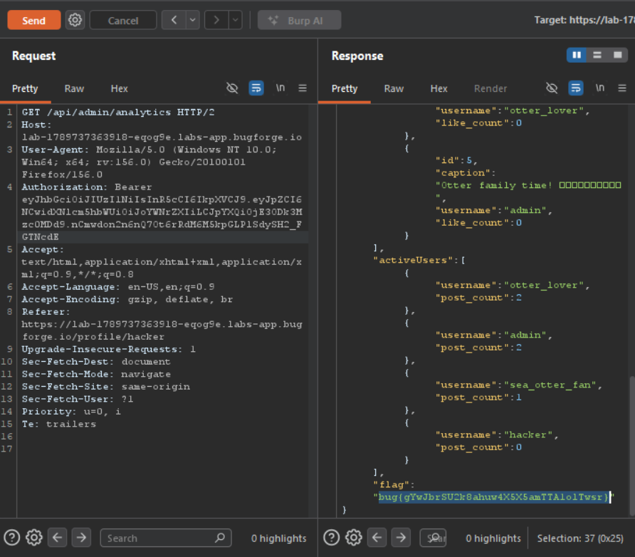

Daily challenge.
Hint: *Devs didn't trust the admins, so they removed them.*

The vulnerability in this lab is *Mass Assignment*.
Sending `PUT` request to `/api/profile` with additional JSON key-value `"role":"dev"`, I changed my role.
Next step is to access `/api/admin/analytics`, I added my authorization token with it's header to this request and sent it. The response is now `200` and showing analytics stats of the lab's website and at the bottom of it was the flag.

