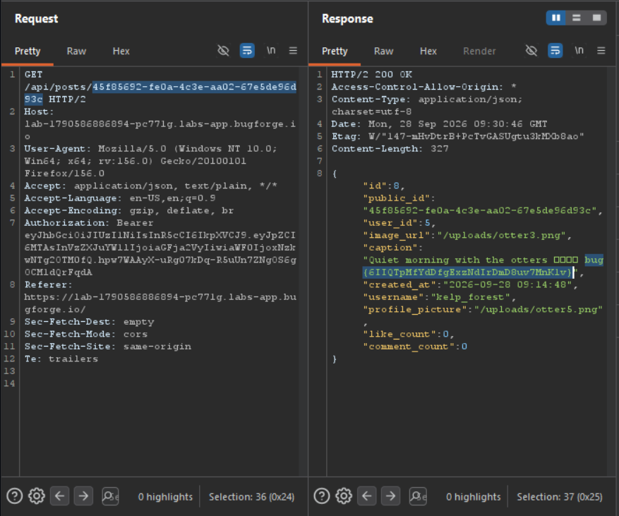

Daily challenge.
Hint: *Can you read private posts?*

After registering an account, I went into search functionality and started to looking at the responses in Burp. When I injected `1` into search query, I spotted a user `kelp_forest` in the response whose account was set to `private`. I took `id` value from that response and I added it to `GET` request to `/api/posts/45f85692-fe0a-4c3e-aa02-67e5de96d93c` endpoint. After sending it, the flag was in the response.

