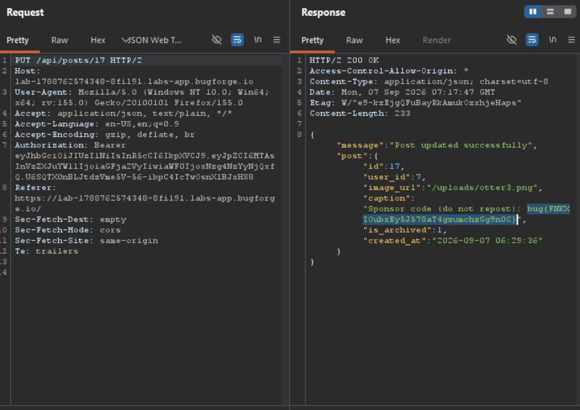

Daily challenge.
Hint: *Some posts are archived.*

When sending `GET` request to the `/api/profile/:username` endpoint, in the response, I could see posts made by any user, and there, each post has `is_archived` key with its value set to `1` or `0`. After going through an app, I created a post, which get an id set to 18.
What I noticed is that there is no post with id 17. So it must be the archived one.
I played around with `/api/posts` request and I found out, that I can send `PUT` request to `/api/posts/17` and see the content of an archived post, where the flag was hidden.

