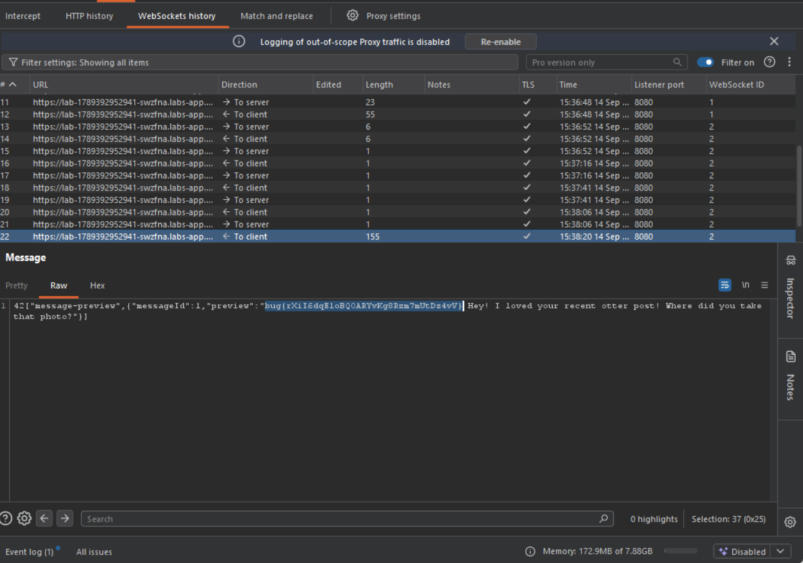

Daily challenge.
Hint: *WebSockets are fun.*

After going through the app, I noticed a feature that allows to send messages to other users. I intercepted this request in Burp and changed ID of recipient to my own, so I was able to send a message to myself. Next I went into `WebSocket history` in Burp's `Proxy` section, and I spotted that there is a message `preview` in the websocket response. I sent this websocket request to Repeater, I connected to current websocket session, and I sent a request to it, with message id changed to `1`. In the response there was a flag.

