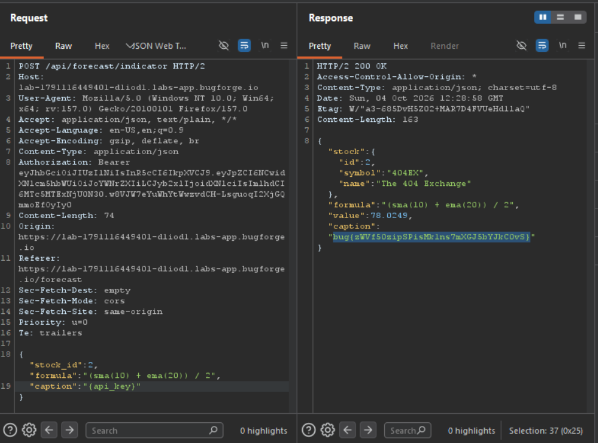

Daily challenge.
Hint: *Can you find the `api_key`?*

In the webapp, there is a *Forecast* functionality, in where I can request *price forecast* for stocks, or evaluate *custom indicator*.
The second functionality sends `POST` request to the `/api/forecast/indicator` endpoint. In the body I have JSON data format with `stock_id` and `formula` used to calculate price of stock.
The interesting part is in the response, which looks like this:
```
{"stock":{"id":2,"symbol":"404EX","name":"The 404 Exchange"},"formula":"(sma(10) + ema(20)) / 2","value":78.0249,"caption":"{value}"}
```

There is a key - `caption` which has a `{value}` as a value.
I injected additional key-value pair into JSON body, which was `"caption":"{api_key}"`. The response contained the flag.

