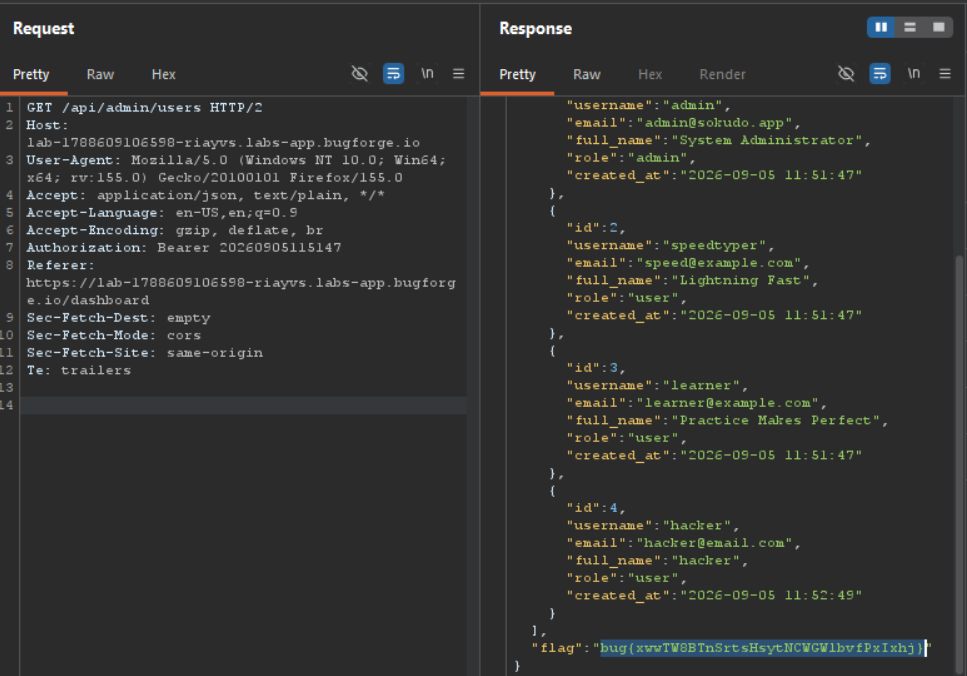

Daily challenge.
Hint: *Broken Authentication. Tokens are fun!*

After registering an account, in the `/api/stats` request there is an `Authorization` header set to - `20260905115249`, which points out to date and exact time of an account creation.
By changing it to - `20260905115147`, in my case, it depends when you start the lab, and then accessing `/api/admin/users` endpoint, you can get a flag.

