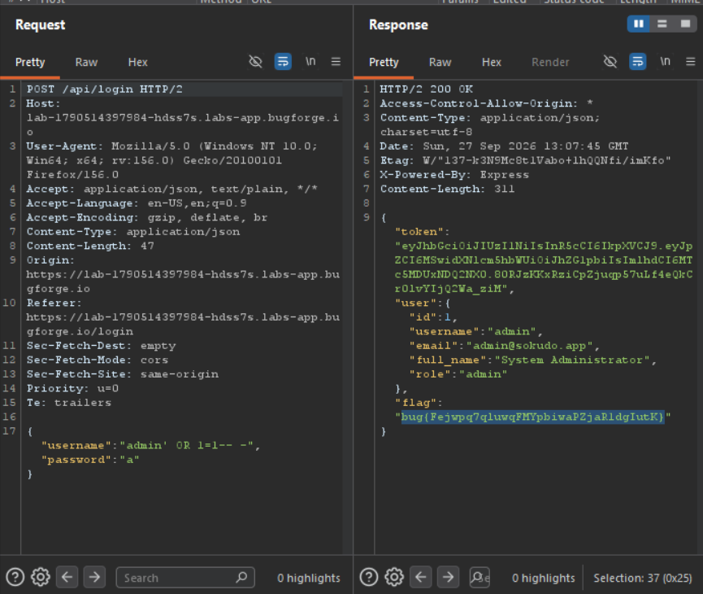

Daily challenge.
Hint: *Can you login as someone else?*

The login page is vulnerable to SQL injection.
I used payload: `admin' OR 1=1-- -` in the username field.
After logging in, the flag is in the response to the `POST` request to `/api/login` endpoint.

