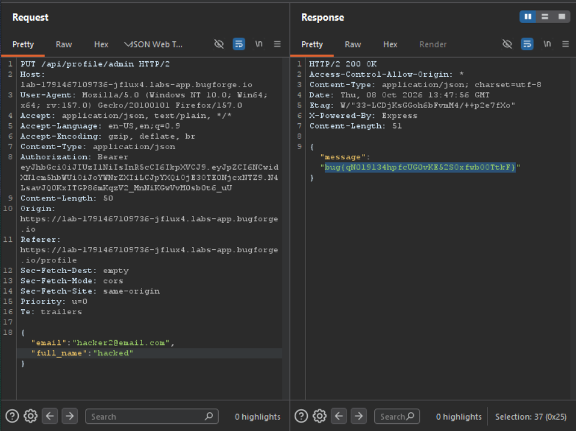

Daily challenge.
Hint: *Can you update another users profile?*

In the *Profile* tab there is a feature to update profile.
I intercepted `PUT` request to `/api/profile/:username`, and changed username value to admin. I sent request and in the response i obtained the flag.

