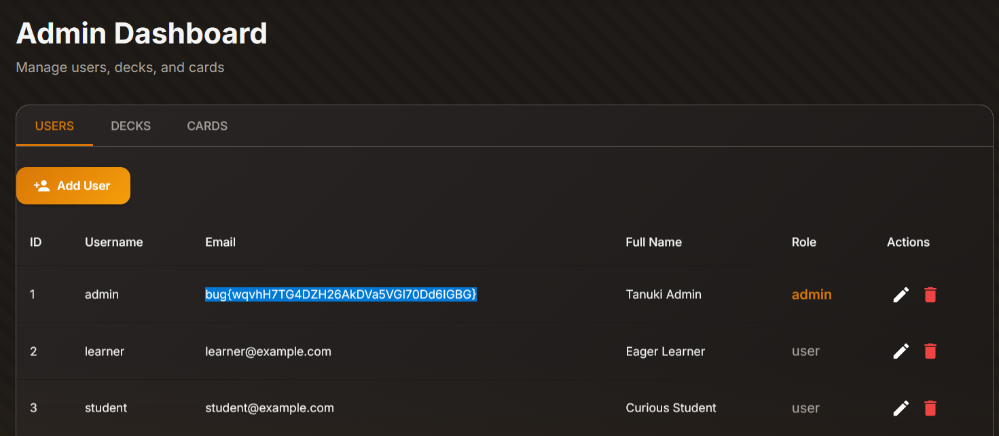

Daily challenge.
Hint: *Can you update the admin's password?*

The app has a change password feature, which is sending a `POST` request to the `/api/profile/change-password` endpoint with `username` and `newPassword` keys in the JSON body.
After adding another username in the array, I was able to change passwords to two separate accounts at once.
After changing admin's password, I logged into his account, and access the admin panel.
The flag was present in the email column.

