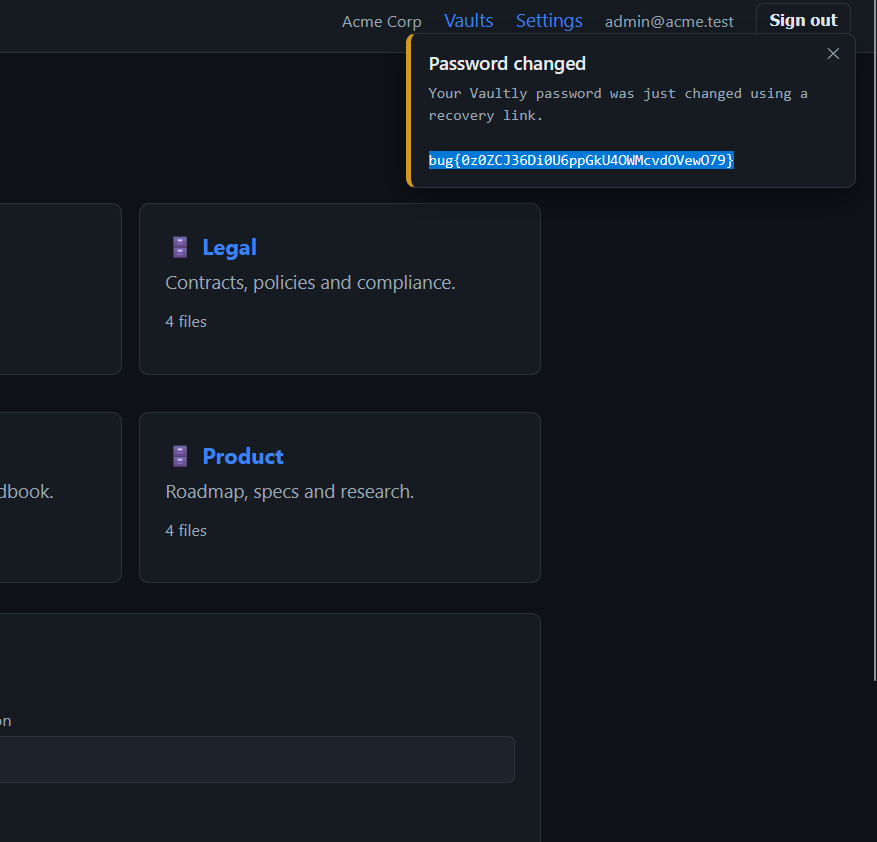

Daily challenge.
Hint: *Can you take over someone else's account?*

First, I logged in as a `owner@acme.test` with provided credentials. I went to Settings -> Security, and requested to email me a reset link. In the link there is a reset token. I intercepted `POST` request to `/api/auth/reset/confirm`, and changed an email to `admin@acme.test`, then forwarded it.
You can change someone else's password using your own reset token. Web app doesn't check if a token is tied to a specific account.
I logged in as an `admin@acme.test` with changed password, and the flag appeared on web page.

