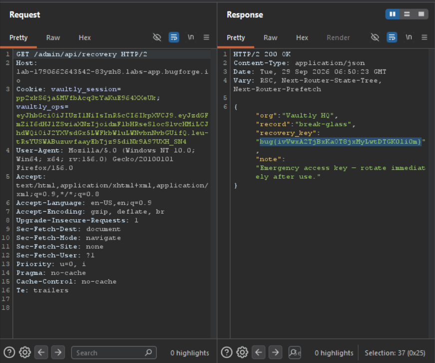

Weekly challenge.
Hint: *_next*

Going after a hint, I found out that the webapp is running on *Next.js* version *14.2.35*. I found this by opening developer tools and searching for `version` in the *debugger* tab.
After googling it out, I found out that this version of Next.js is vulnerable to SSRF.
I logged in as an owner with provided credentials, and after doing so, I noticed in the *Network* tab that server is fetching an image from local host `/_next/image?url=http://127.0.0.1:9000/badge/soc2.svg&w=256&q=75`.
I started testing it, first thing I done was removing `/badge/soc2.svg` from the path, so the URL was like this: `/_next/image?url=http://127.0.0.1:9000/&w=256&q=75` and in the response I saw an image, which showed me two `.svg` files on the server. One was `soc2.svg` and the second `signing-key.svg`. So I attempted to access the second one.
After sending a request `/_next/image?url=http://127.0.0.1:9000/badge/signing-key.svg&w=256&q=75` I was able to retrieve all the information about JWT tokens used for accessing `/admin` panel.
```
Vaultly HQ — Ops Session Signing Keycookie: vaultly_ops alg: HS256 console: /adminrequired claims: {"staff":true,"iss":"vaultly-hq-ops","aud":"vaultly-admin-console"}HS256 key (utf-8 bytes of this hex string):8a6327a4a2577a6c6c23fef33ac9e47d0eb68ebd9ce78b155124d0974ffb42b6
```
Now it's time for crafting a valid JWT token.
I went to `jwt.io` website, clicked on JWT Encoder, and I put payload and secret key.
Copied token, and I went to `/admin` of our challenge page, I opened dev tools, storage - created new token named `vaultly_ops` and pasted JWT created on a jwt.io.
I was able to access `/admin` panel. There was an information about `/admin/pi/recovery` endpoint, so I accessed it. And there, in the response in `recovery_key` field was the flag.

