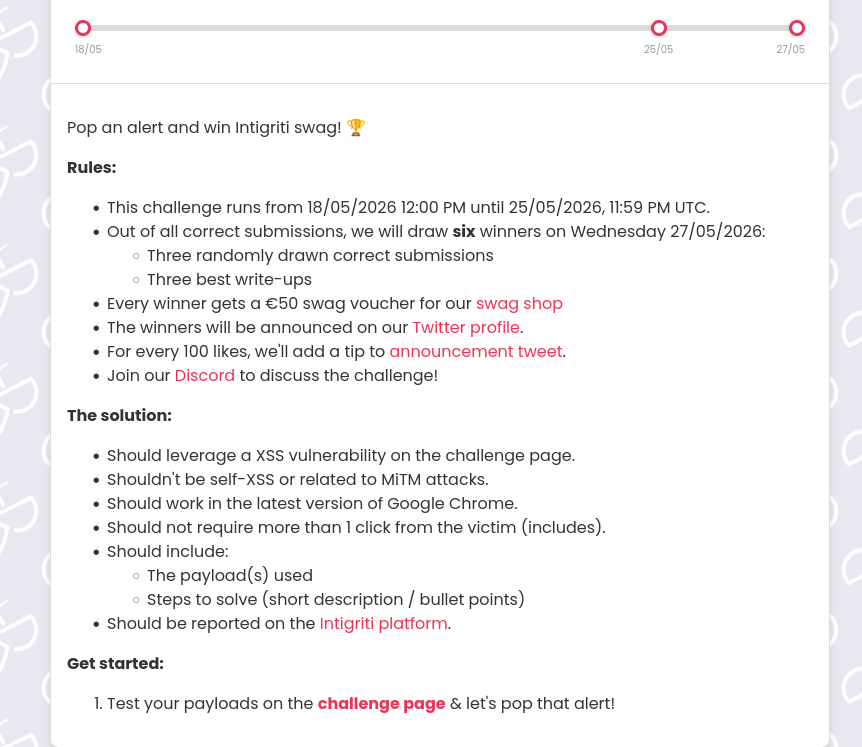
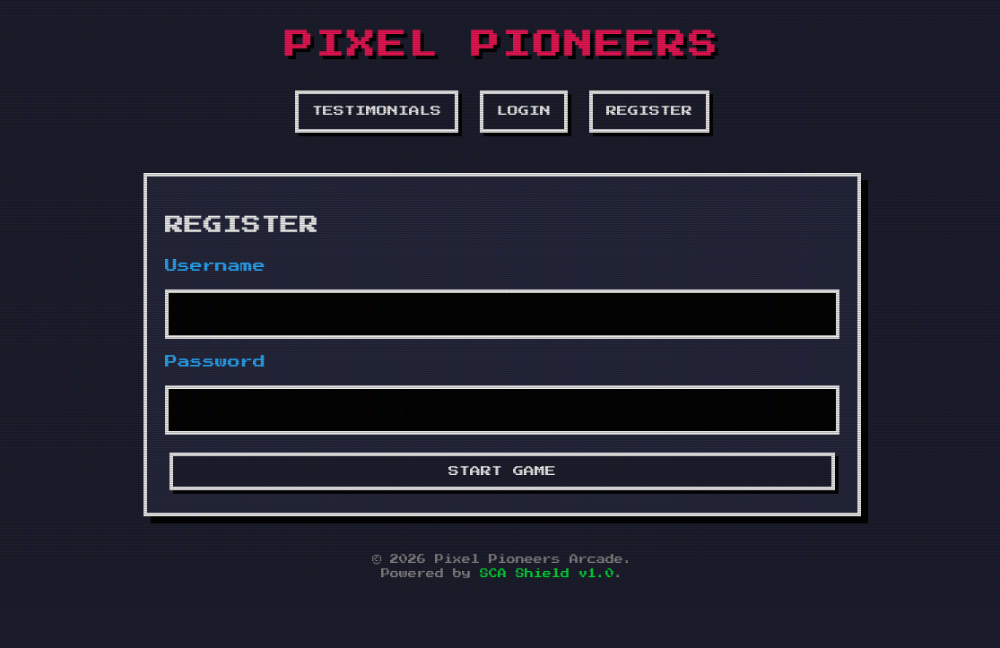
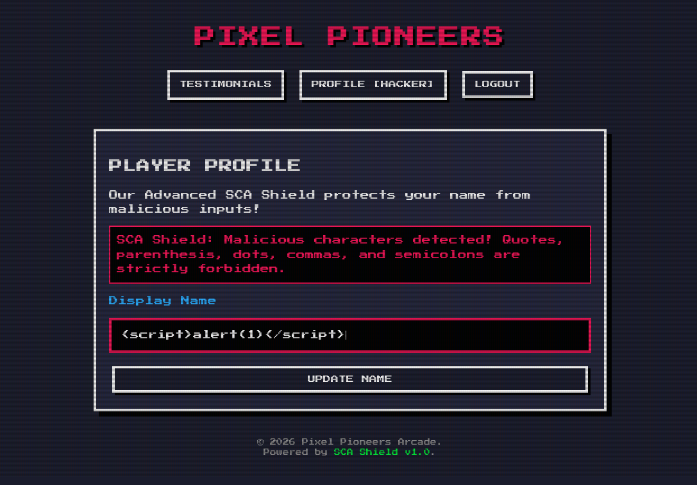
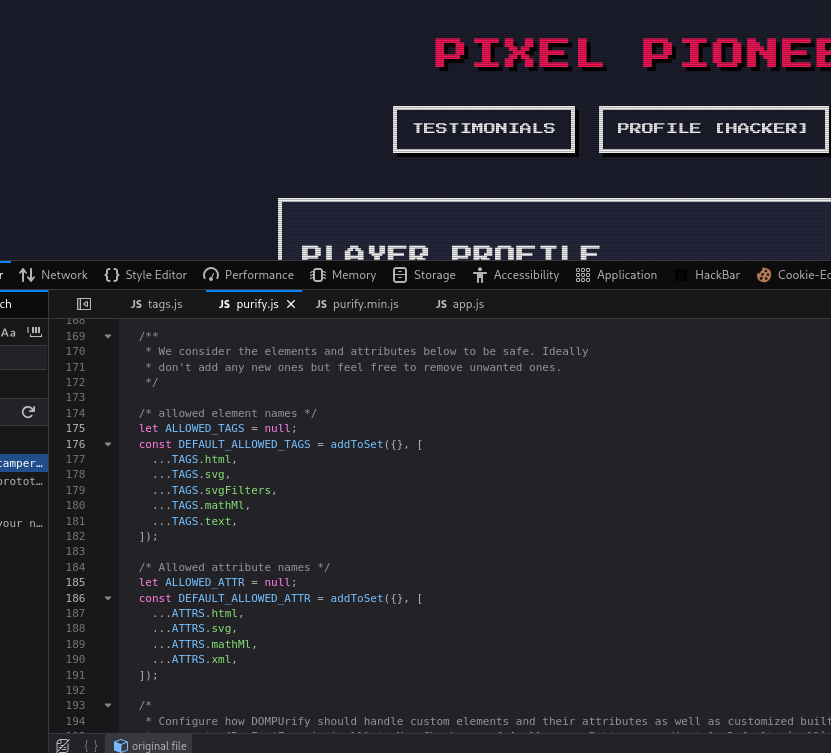
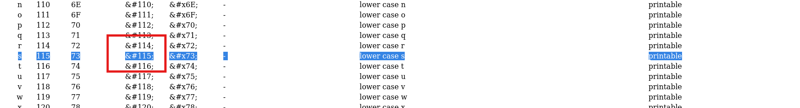
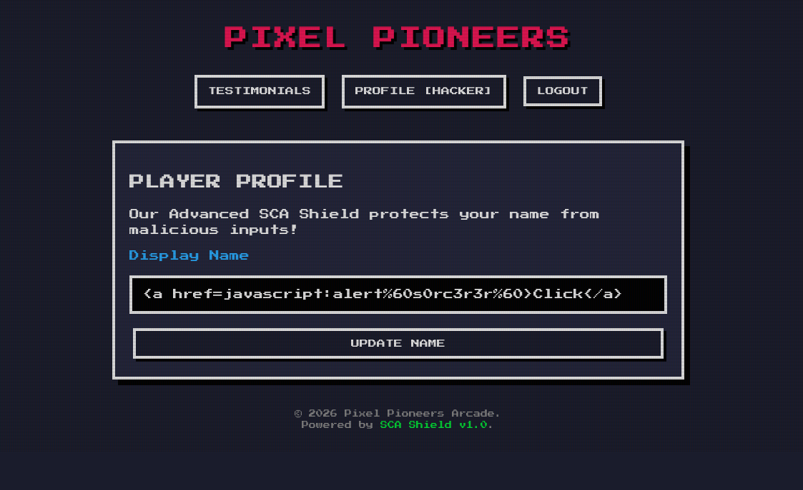
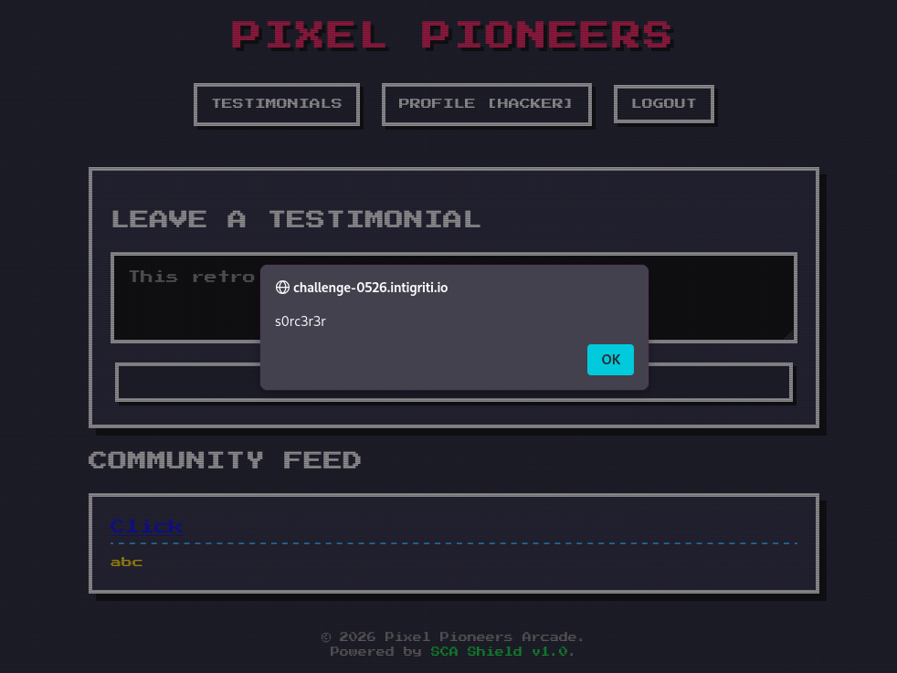

Hi! This is my writeup for May's - 0526 Intigriti's challenge! And this is how i did it. Enjoy!

The challenge page says that I need to pop up an alert on the site.

After going to the challenge page, I needed to register an account.

Then In the Profile page I tried the basic XSS payload ``
But the SCA Shield stopped me.

From this I knew that dots, quotes, parenthesis, commas, and semicolons are forbidden. So I needed to work around it. I decided to use backticks instead of parenthesis. Also I checked js files for information what is allowed and what is not.

From this I decided to use <a href> attribute, because the html attributes are allowed, and put my payload in the hyperlink. But javascript, was also blacklisted and i couldn't use it. So I encoded one letter from it to html decimal.

So, my payload looked like this: `<a href=java&#115cript:&#x61lert%60s0rc3r3r%60>Click</a>`

I put it in my display name as you can see below and saved:

And it went through!
Next, I created some random testimony and published it.
Instead of my name there was a clickable element saying "Click", and when I clicked it... Boom! Alert poped out.

Thanks for reading!