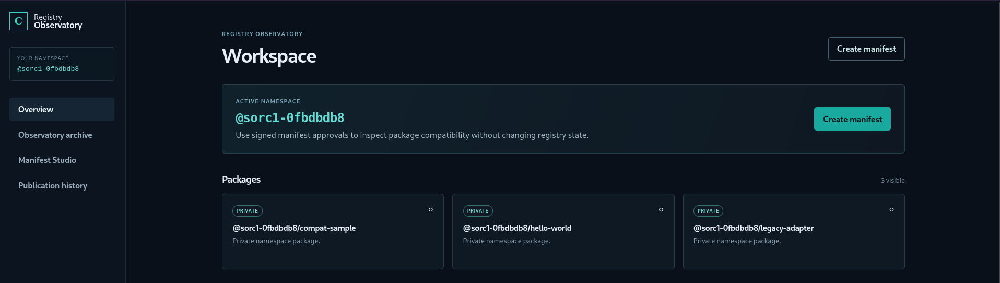
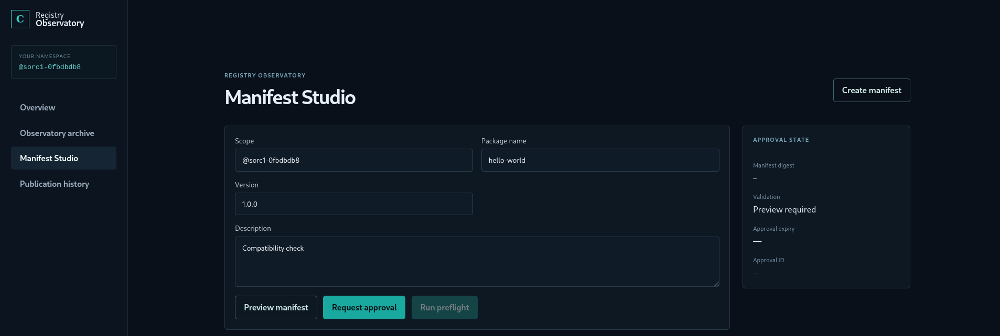
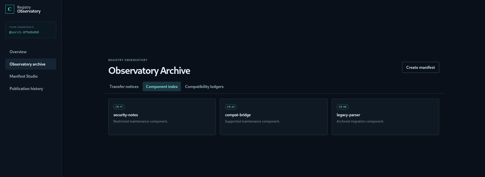
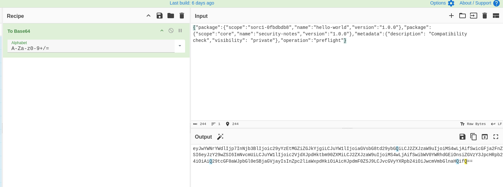
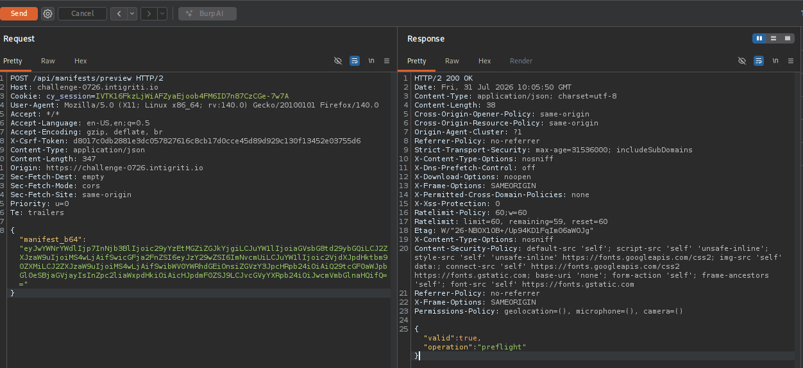
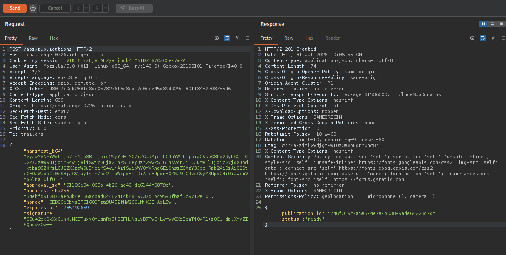
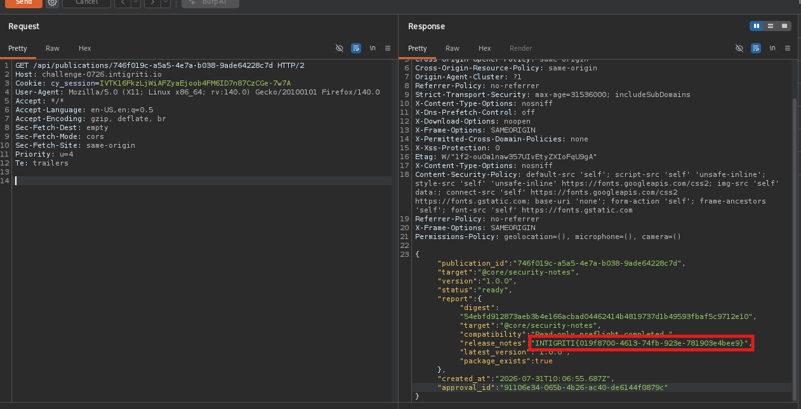
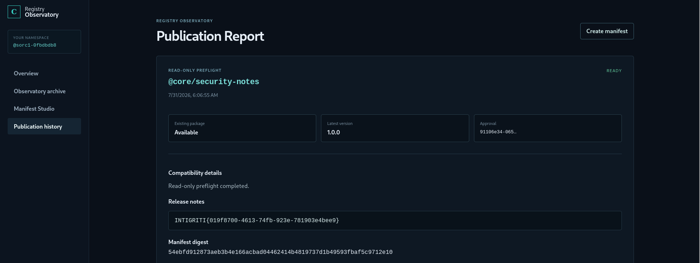

# Registry Observatory — Cross-Namespace Report Disclosure via Duplicate-Key JSON Parsing Differential

**Challenge:** Registry Observatory (challenge-0726.intigriti.io)
**Category:** Broken Access Control
**CWE:** CWE-284 – Improper Access Control
**Flag:** `INTIGRITI{019f8700-4613-74fb-923e-781903e4bee9}`

## Summary

Registry Observatory is a package registry front-end that lets authenticated users generate signed "preflight compatibility reports" for packages under their own namespace. The report generation flow is split into three stages — preview, sign, and publish — each of which independently parses the same base64-encoded JSON manifest. By submitting a manifest containing a **duplicate top-level key**, it was possible to make the authorization stage and the report-generation stage each read a *different* value for that key, allowing a report to be generated and read for a restricted, platform-owned package outside the attacker's namespace.

## Recon

The challenge landing page describes the application and its goal: retrieve a protected compatibility report containing the flag, without modifying registry data or attacking the infrastructure directly.



After registering an account, the application assigns a random private namespace (scope) and exposes a "Manifest Studio" where users can build a manifest for one of their own packages, request a signed approval, and publish a compatibility report against it.



The application also exposes an "Observatory Archive" containing advisories, a component catalog, and version references. Cross-referencing these three read-only endpoints revealed that one package — `security-notes` — sits under a fixed scope called `core`, is explicitly labeled a "Restricted maintenance component," and is called out in an advisory as having been moved into a "platform-maintained namespace." This strongly suggested the flag lived inside a report for `@core/security-notes`.



## Understanding the manifest flow

Every manifest submitted to the API is a base64-encoded JSON object of the form:

```json
{
  "package": { "scope": "...", "name": "...", "version": "..." },
  "metadata": { "description": "...", "visibility": "..." },
  "operation": "preflight"
}
```



This payload is sent through three endpoints in sequence:

1. `POST /api/manifests/preview` — validates the manifest and checks that the requester is authorized for the given `package.scope`.
2. `POST /api/manifests/sign` — re-validates and issues a signed approval (`approval_id`, `manifest_sha256`, `nonce`, `expires_at`, `signature`) bound to the manifest.
3. `POST /api/publications` — accepts the manifest together with the approval fields, verifies the hash/signature binding, and generates the actual compatibility report.

Testing showed the hash/signature binding between steps 2 and 3 was solid — tampering with the manifest after signing, reusing approvals across different manifests, or simply swapping `package.scope` to `core` was consistently rejected by both the preview and sign stages, since both independently enforce that the manifest's scope matches the authenticated user's namespace.

## The vulnerability

The key insight came from a hint pointing at how "approval and report generation relate to one another." This suggested the two stages might not be validating the *same* logical content, even when given byte-for-byte identical input.

JSON technically allows duplicate keys within an object, and different JSON parsers (or independent parsing passes within the same application) can resolve such duplicates inconsistently — one implementation may keep the first occurrence, another the last. Since `manifest_sha256` is computed over the raw decoded bytes rather than a canonical representation of the parsed object, a manifest with a duplicate key still produces a single, consistent, verifiable hash — regardless of which of the two duplicate values any given stage actually acts on.

Exploiting this, a manifest was crafted with **two top-level `package` keys**: the first pointing at a package legitimately owned by the attacker's own scope, and the second pointing at the restricted `@core/security-notes` package.

- `POST /api/manifests/preview` and `POST /api/manifests/sign` both evaluated the **first** `package` key, saw a scope the requester legitimately owns, and approved the manifest normally, issuing a valid signed approval.



- `POST /api/publications`, however, resolved the **second** `package` key when generating the actual report — producing and publishing a "ready" report for `@core/security-notes`, despite the approval having been granted on the basis of the attacker's own, unrelated package.



## Retrieving the report

With a valid `publication_id` in hand, the report was fetched directly:

`GET /api/publications/{publication_id}`

The response contained the full compatibility report for `@core/security-notes`, including a `release_notes` field holding the flag.





## Root Cause

Authorization (preview/sign) and report generation (publish) each parse the same raw manifest bytes independently, and disagree on how to resolve a duplicate JSON key. Because the manifest hash is computed over raw bytes rather than a canonical form of the parsed object, this divergence is invisible to the integrity/signature checks that bind the approval to "the manifest" — the checks guarantee byte-level integrity, not a single, unambiguous semantic interpretation of that data. This allowed authorization to be granted for one package while the resource actually acted upon was a different, unauthorized one.

## Impact

Any authenticated, low-privileged user could obtain a validly signed publication for, and read the full report of, a restricted package outside their own namespace — a broken access control issue with direct disclosure of sensitive/restricted data.

## Remediation Suggestions

- Reject manifests containing duplicate keys before any further processing (strict parsing with duplicate-key detection).
- Parse the manifest once and reuse the same parsed object across preview, sign, and publish stages rather than re-parsing raw bytes independently at each stage.
- Hash/sign a canonicalized representation of the manifest (e.g. RFC 8785 JCS) rather than raw bytes, so that ambiguous inputs cannot produce a single "valid" hash for multiple differing interpretations.
