Hello! This is writeup for room called "Benign" which is in a SOC Level1 Path on tryhackme.com. If you're stuck and looking for answer feel free to look into it. Enjoy!

Room Description:
One of the client’s IDS indicated a potentially suspicious process execution indicating one of the hosts from the HR department was compromised. Some tools related to network information gathering / scheduled tasks were executed which confirmed the suspicion. Due to limited resources, we could only pull the process execution logs with Event ID: 4688 and ingested them into Splunk with the index **win_eventlogs** for further investigation.

After deploying your machine, navigate to the url bar in your browser and paste an IP address of your machine. You should see splunk home page which is one of SIEM solution out there. And then click the "Search and Reporting" on the left side of the screen as you can see below.

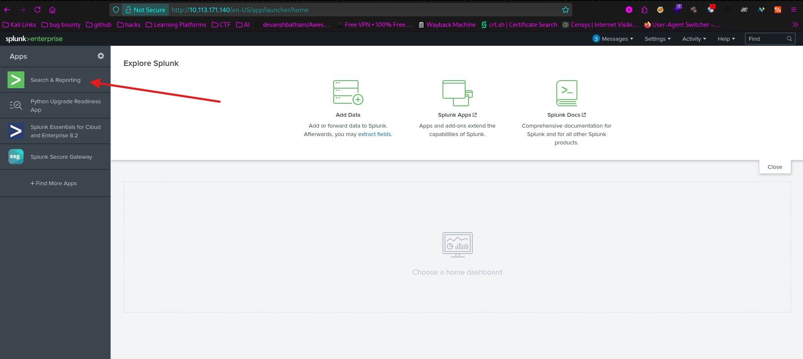

After doing so, you can see a search bar, where we will be putting our queries to find specific logs.
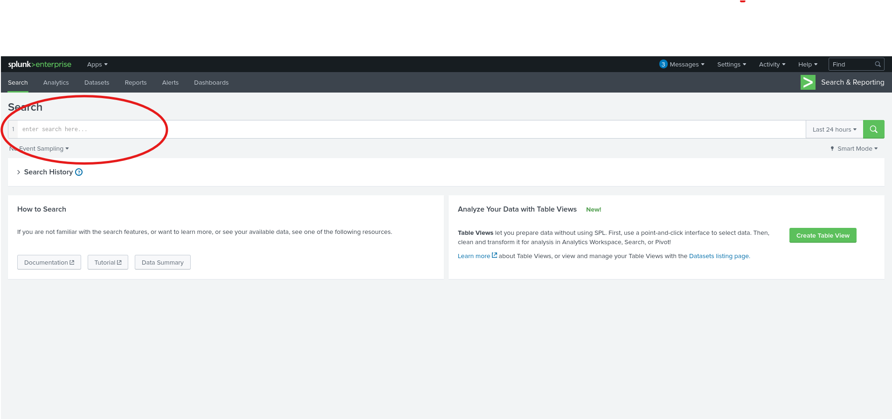

We know from the room description that our logs are named **win_eventlogs**. Now we need to type **index=win_eventlog** into search bar. Do not forget to change time preset to "All-time", because we do not know for now when events occured.
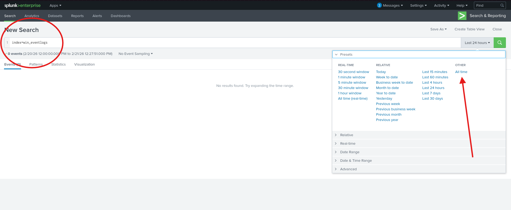

**Question 1:**
**1.How many logs are ingested from the month of March, 2022?**

To do so, irl we would change the date presets as you can see in the screenshot below:
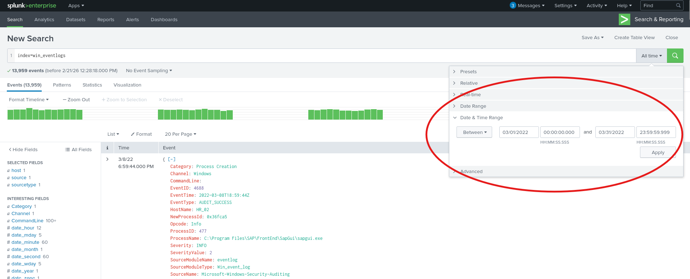

And we can see that in our "win_eventlogs" we only have logs from march.
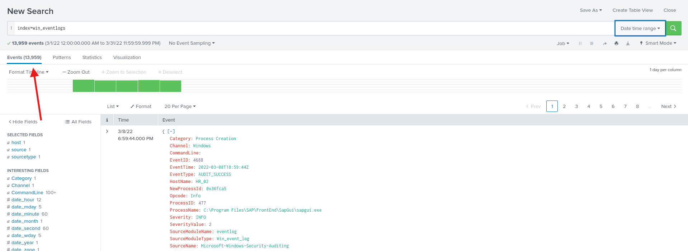
**Answer: 13959**

**Question 2:**
**Imposter Alert: There seems to be an imposter account observed in the logs, what is the name of that user?**

In the room description we have additional information about the network. Let's take a look into it:
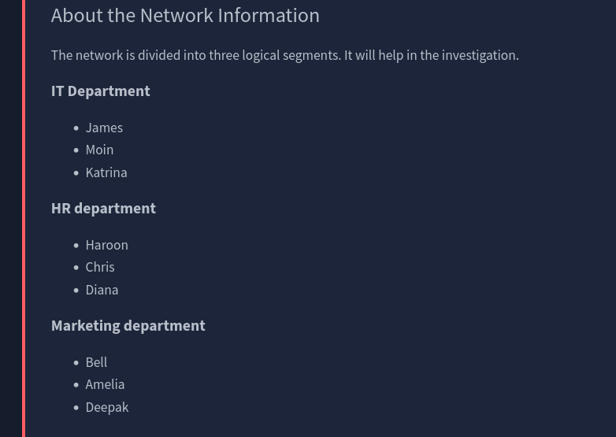
After looking into it we can see names of the employees. Now we know that there is 9 employees overall. Let's take a look into logs.
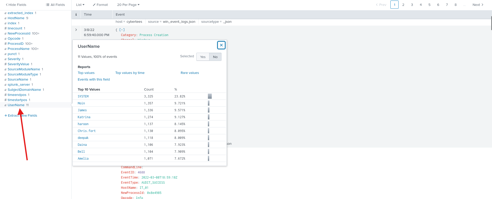
After clicking on a "UserName" field in the Interesting fields panel, we can see that there is 11 usernames occuring in a file.
We can be sure that the "SYSTEM" user is legit. To find missing user click on a "Rare values" which will be added to the search query.
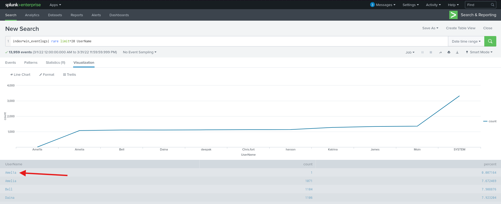

We found rouge user whos name is "Amel1a".
**Answer: Amel1a**

**Question 3:**
**Which user from the HR department was observed to be running scheduled tasks?**

To do this we need to filter logs for scheduled tasks. I've added **ProcessName="\*\schtasks.exe"** to the query:

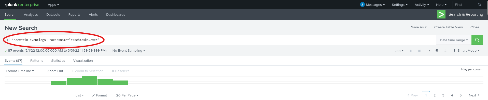

Now let's take a look at users who ran it.
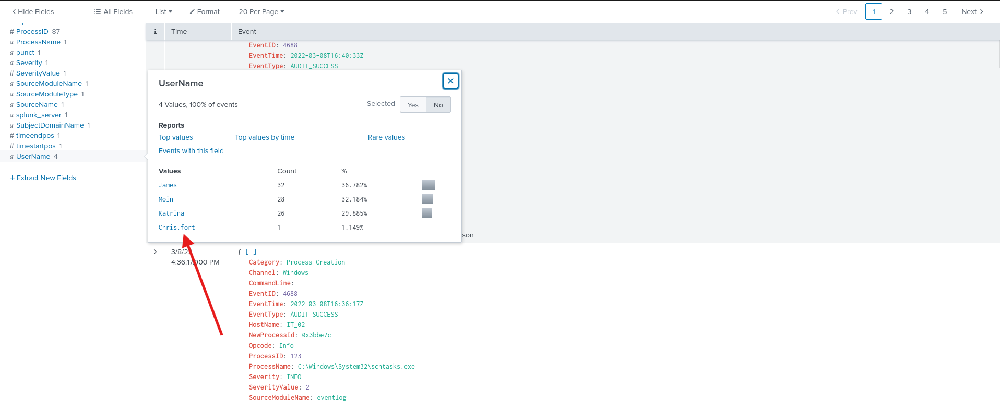
Here we can we the user who ran scheduled task only once, and guess what... He's in a HR Department. We can see it in a provided earlier in the room information about this specific network.

**Answer: Chris.fort**

**Question 4:**
**Which user from the HR department executed a system process (LOLBIN) to download a payload from a file-sharing host.**

Ok. Let's take a look into it.
From the question we know that threat actor used LOLBINs (Living off the Land Binaries) to download malicious file from the Internet. There is one specific LOLBIN that can be used by threat actors to download something and it is *certutil.exe*.

Let's add this binary to our query:
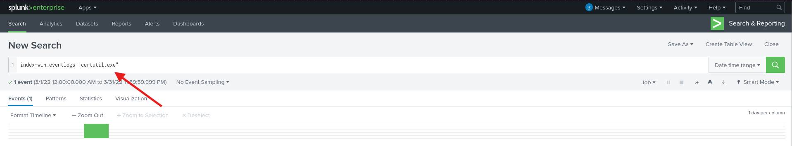

And now we can see who's behind downloading malicious files:
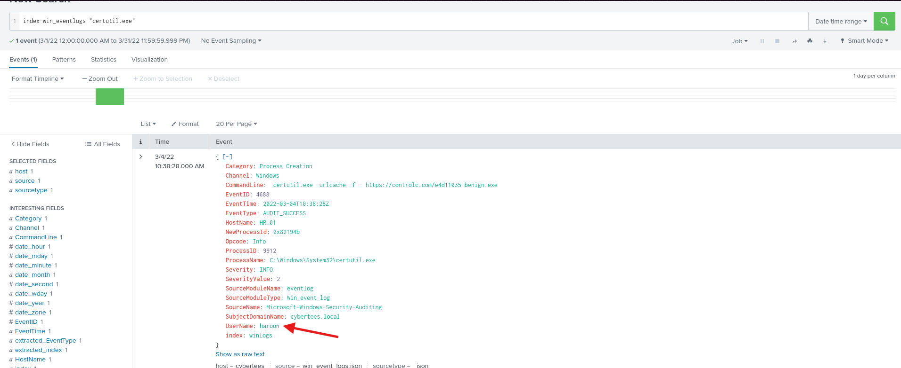
**Answer: haroon**

**Question 5:**
**To bypass the security controls, which system process (lolbin) was used to download a payload from the internet?**

There are few LOLBINs that can be used to download a file from the Internet. Threat actor could use *powershell.exe*, *certutil.exe* or *bitsadmin.exe*. I've searched all of them and found a hit:
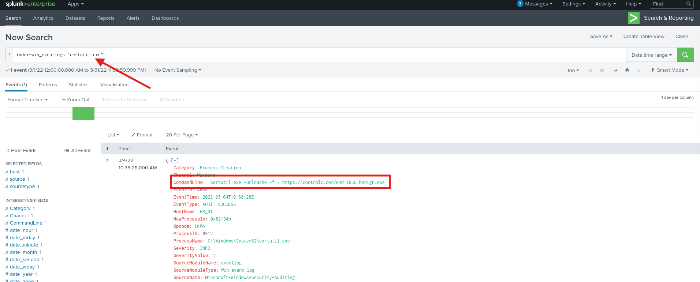
**Answer: certutil.exe**

**Question 6:**
**What was the date that this binary was executed by the infected host? format (YYYY-MM-DD)**

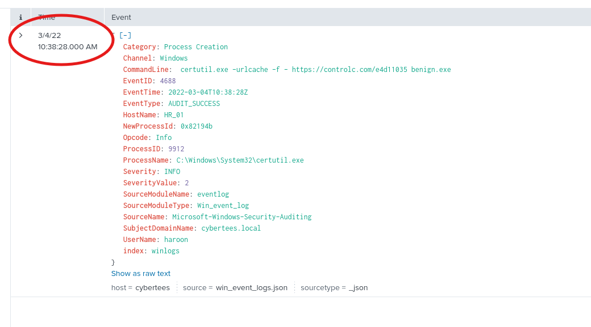
**Answer: 2022-03-04**

**Question 7:**
**Which third-party site was accessed to download malicious payload?**
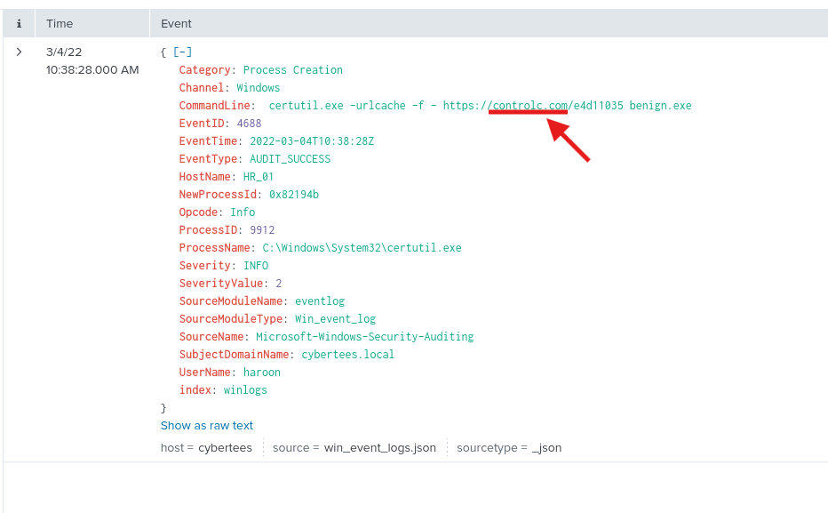
**Answer: controlc.com**

**Question 8:**
**What is the name of the file that was saved on the host machine from the C2 server during the post-exploitation phase?**
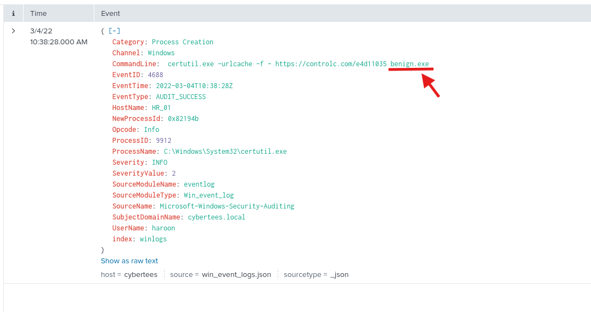
**Answer: benign.exe**

**Question 9:**
**The suspicious file downloaded from the C2 server contained malicious content with the pattern THM{.............}; what is that pattern?**

Flag time. It is tricky, but not hard at all. My first thought was i need to find this flag somewhere in the log file, but after reading last question i have realized that i need to visit an URL.
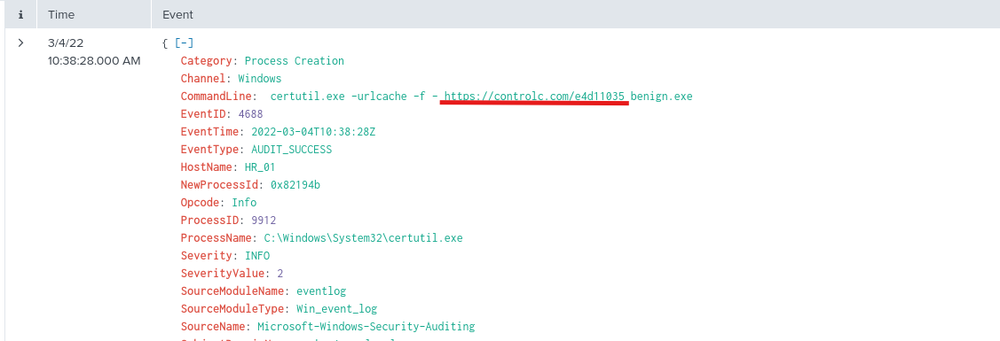

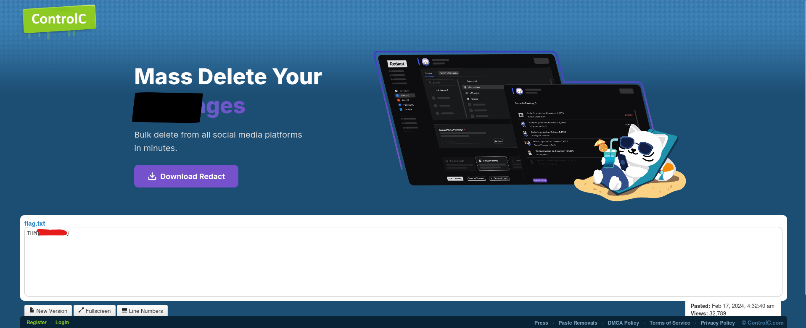
And that's how you find malicious content in the benign file.
**Answer: THM{}**
Go and grab it yourself!

**Question 10:**
**What is the URL that the infected host connected to?**
**Answer: https\://controlc.com/e4d11035**
