Hi and welcome to another writeup of a tryhackme room from SOC Level 1 path. Today i'm gonna guide you through a room called Boogeyman2. If you're stuck and need help you found a good place. Enjoy!

In this room, you will be tasked to analyse the new tactics, techniques and procedures (TTPs) of the threat group named Boogeyman.
For the investigation, you will be provided with the following artefacts: copy of the phishing email and memory dump of the victim's workstation.
Tools provided by the room are: Volatility and Olevba.

Room description:
Maxine, a human Resource Specialist working for Quick Logistics LLC, received an application from one of the open positions in the company. Unbeknownst to her, the attached resume was malicious and compromised her workstation.
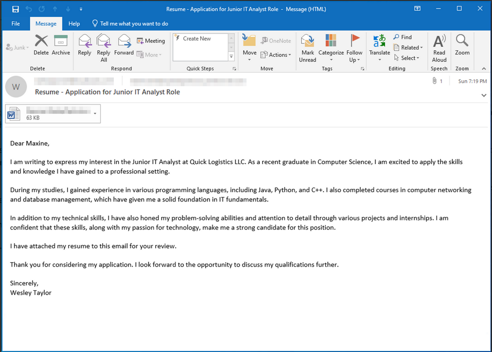

The security team was able to flag some suspicious commands executed on the workstation of Maxine, which prompted the investigation. Given this, you are tasked to analyse and assess the impact of the compromise.

Let's jump into questions.
**Question 1: What email was used to send the phishing email?**

In the deployed machine we got an Artefacts folder in where we can find eml file of a malicious email send to Maxine.
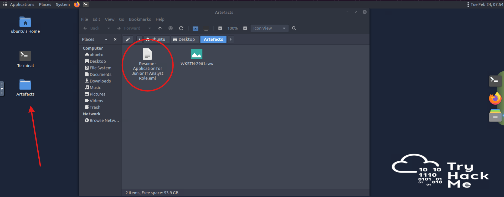

I had opened it in Inbox and found out that an email was sent from westaylor23@outlook\.com.

**Answer: westaylor23@outlook\.com**

**Question 2: What is the email of the victim employee?**

You can find this information in the same way you found previous one.

**Answer: maxine.beck@quicklogisticsorg\.onmicrosoft.com**

**Question 3: What is the name of the attached malicious document?**

To find this information click on *Save As* button as shown bellow:
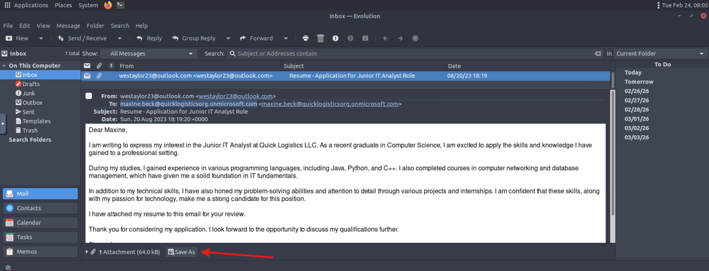
Then you gonna see name of the file in the search bar:
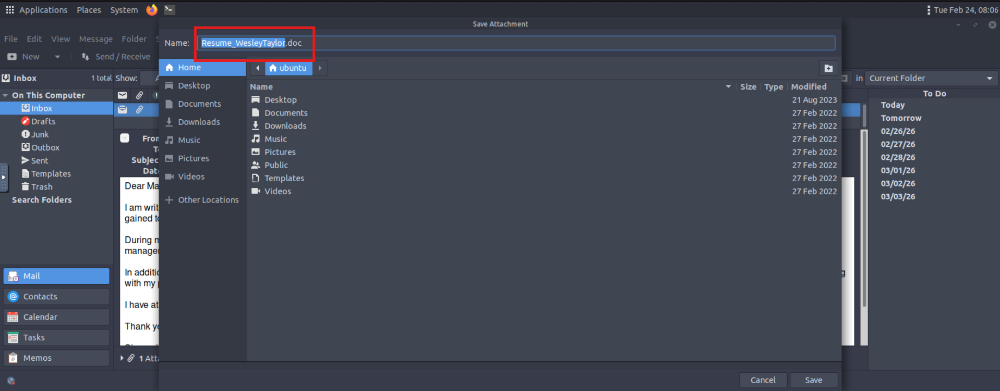
Finally i'm gonna save it in the */Desktop/Artefacts* directory. It will be useful later on.

**Answer: Resume_WesleyTaylor.doc**

**Question 4: What is the MD5 hash of the malicious attachment?**

Now go into the terminal, navigate to Artefacts folder by invoking command *cd Desktop/Artefacts*. Now when we're in directory where we saved our attachment earlier, we need to calculate md5 hash of the file by using *md5sum Resume_WesleyTaylor.doc* command. 
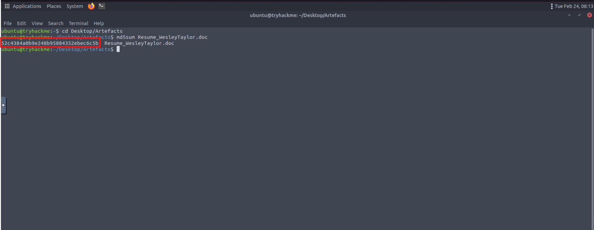

**Answer: 52c4384a0b9e248b95804352ebec6c5b**

**Question 5: What URL is used to download the stage 2 payload based on the document's macro?**

To find out macro's in the document we need to use a tool mentioned earlier - olevba.
After running the command *olevba Resume_WesleyTaylor.doc* we're gonna see a hidden code included into the malicious doc file.
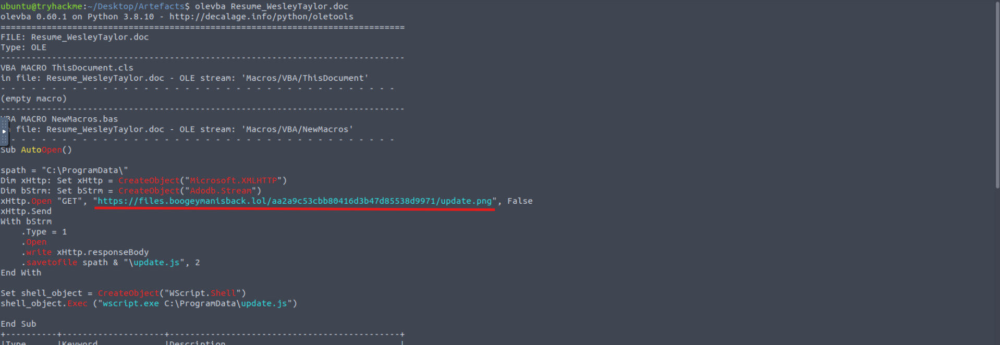
And there is a link to a file that is downloaded after opening a document.

**Answer: https\://files.boogeymanisback.lol/aa2a9c53cbb80416d3b47d85538d9971/update.png**

**Question 6: What is the name of the process that executed the newly downloaded stage 2 payload?**

You can find this information in the table of the output of previously ran command:
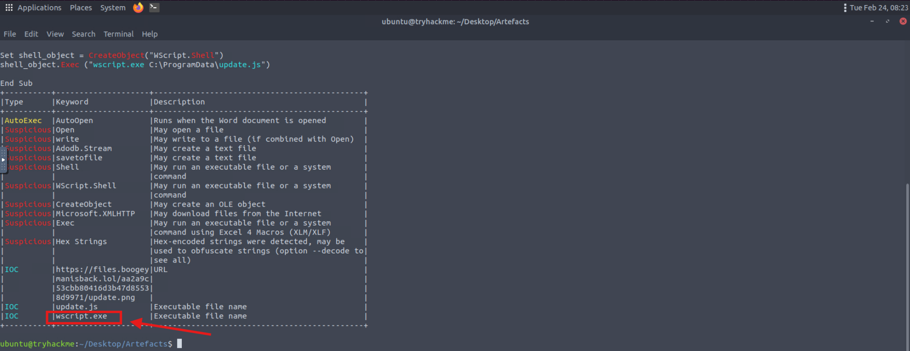

**Answer: wscript.exe**

**Question 7: What is the full file path of the malicious stage 2 payload?**

And again olevba gives as answers to another question:
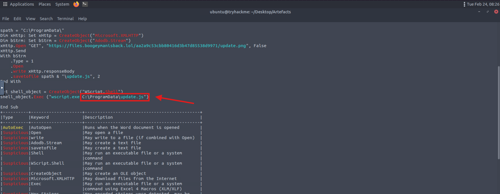

**Answer: C:\ProgramData\update.js**

**Question 8: What is the PID of the process that executed stage 2 payload?**

To find this out i'm gonna use another tool that was provided in this room - volatility. First i'm gonna check what plugins can i use to find out the answer by runnin command: *vol -f  WKSTN-2961.raw -h*
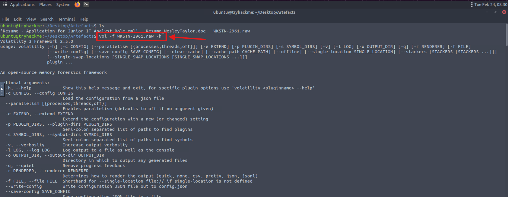
You should know by now that the attacked machine was running windows. I'm gonna check windows specific plugins that can list processes ran on the machine.
I found the one that will be useful for us. The plugin is called: *windows.getsids.GetSIDs*. The command i'm gonna run is: *vol -f WKSTN-2961.raw windows.getsids.GetSIDs*. And after a moment, i got an output where is a malicious process *wscript.exe* i've found earlier.
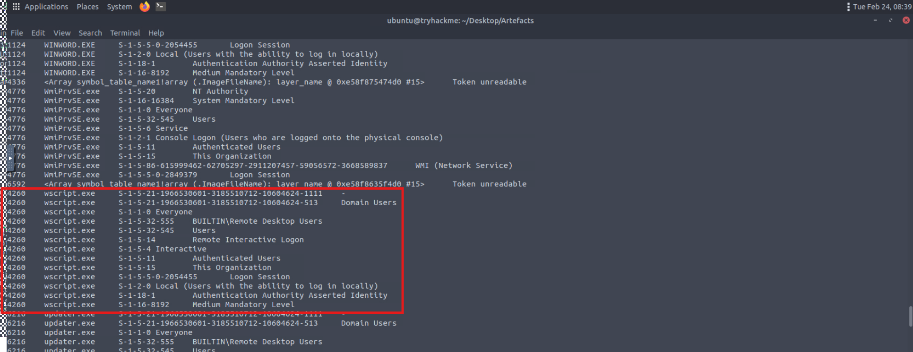
**Answer: 4260**

**Question 9: What is the parent PID of the process that executed the stage 2 payload?**

To find this out i will use another volatility plugin which is *windows.pstree.PsTree*.
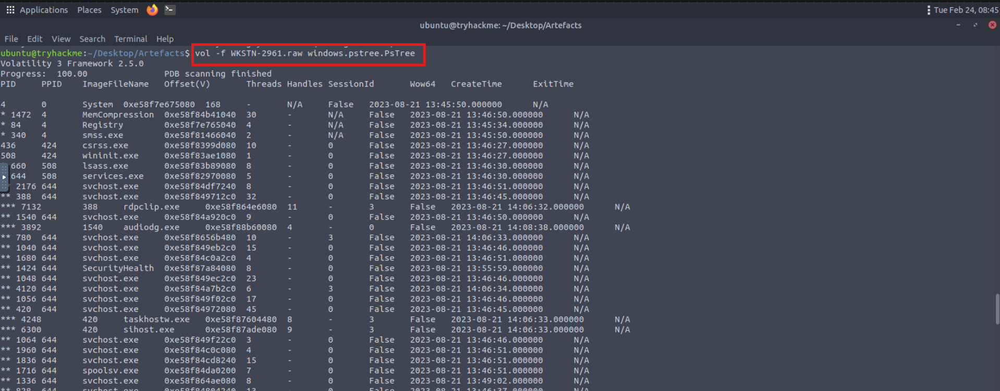

In the output i'm gonna look for malicious *wscript.exe* process.
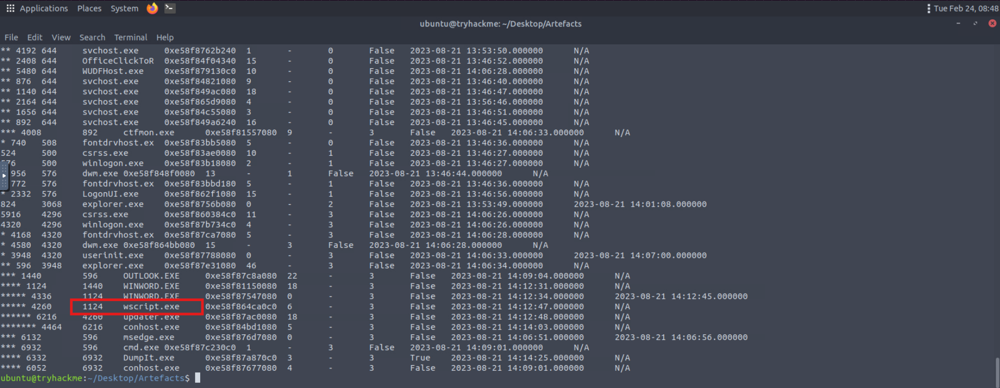

**Answer: 1124**

**Question 10: What URL is used to download the malicious binary executed by the stage 2 payload?**

'To find this out i've tried to run some volatility plugins, but without success. Finally i got an idea to run simple strings command on .raw file in the Artefacts directory with grep. As for now i know that files were downloaded from files.bogeymanisback.lol domain. I've used this knowledge to find out what file beside update.png was downloaded to the machine.
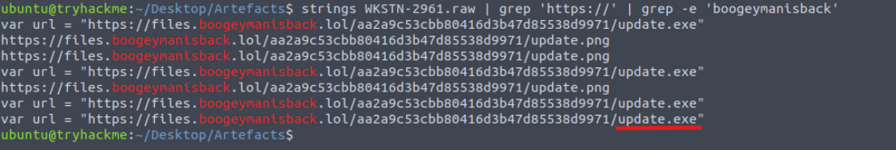

**Answer: https\://files.boogeymanisback.lol/aa2a9c53cbb80416d3b47d85538d9971/update.exe**

**Question 11: What is the PID of the malicious process used to establish the C2 connection?**

To find this out i've ran volatility plugin *windows.pstree.PsTree* and i've found out that previously investigated process *wscript.exe* that downloaded malicious file from the server is a parent process to *updater.exe* which has PID 6216.
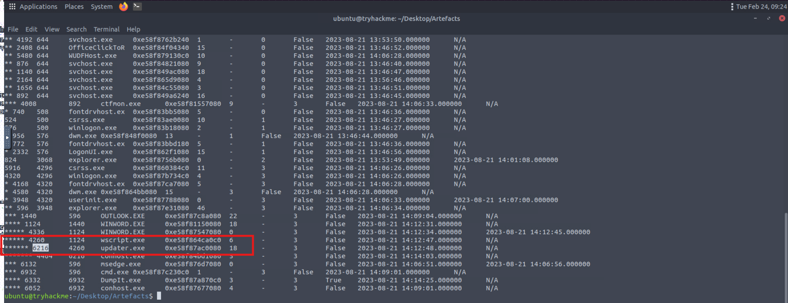
**Answer: 6216**

**Question 12: What is the full path of the malicious process used to establish the C2 connection?**

To find an answer to this question i've ran *strings + grep* on a WKSTN-2961.raw file. And with that i've found out location of the updater.exe.
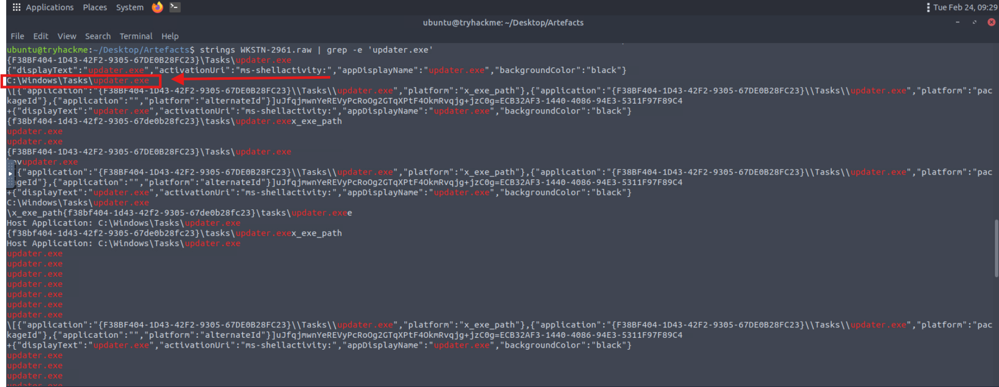
**Answer: C:\Windows\Tasks\updater.exe**

**Question 13: What is the IP address and port of the C2 connection initiated by the malicious binary? (Format: IP address:port)**

To find this out i needed to ran *windows.netscan* plugin in volatility.
After doing so i've noticed that *updater.exe* connects to foreign IP address on port 8080 from infected machine.
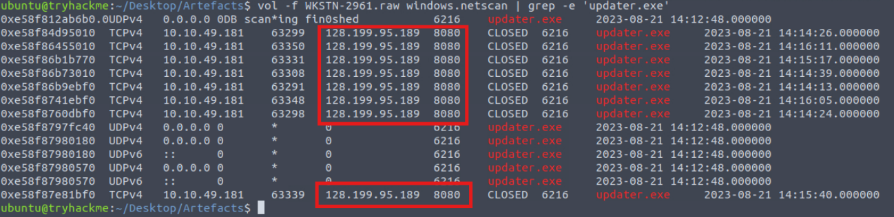
**Answer: 128.199.95.189:8080**

**Question 14: What is the full path of the malicious email attachment based on the memory dump?**

I used plugin *windows.filescan* to find this out, with a little help from *grep*. Going through plugins earlier and knowing name of the email attachment it was pretty easy to find out.
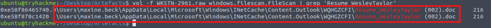
**Answer: C:\Users\maxine.beck\AppData\Local\Microsoft\Windows\INetCache\Content.Outlook\WQHGZCFI\Resume_WesleyTaylor (002).doc**

**Question 15: The attacker implanted a scheduled task right after establishing the c2 callback. What is the full command used by the attacker to maintain persistent access?**

I know that to set up scheduled tasks on windows i need to use schtasks command. Knowing so i've used *strings + grep* on .raw file and got the answer:
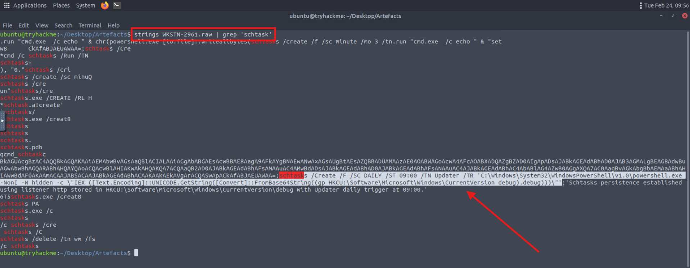
**Answer: schtasks /Create /F /SC DAILY /ST 09:00 /TN Updater /TR ‘C:\Windows\System32\WindowsPowerShell\v1.0\powershell.exe -NonI -W hidden -c \”IEX (\[Text.Encoding]::UNICODE.GetString(\[Convert]::FromBase64String((gp HKCU:\Software\Microsoft\Windows\CurrentVersion debug).debug)))\”’**

That's it! Room is finished. I hope you found answers needed. Thanks for coming by. Peace!
