Welcome in another writeup from the series of CTFs on tryhackme platform called Boogeyman. Here I'm gonna walk you through part 3 of the series. Let's begin!

*Due to the previous attacks of Boogeyman, Quick Logistics LLC hired a managed security service provider to handle its Security Operations Center. Little did they know, the Boogeyman was still lurking and waiting for the right moment to return.*
In this room, you will be tasked to analyse the new tactics, techniques, and procedures (TTPs) of the threat group named Boogeyman.
Provided machine runs an Elastic Stack.

Without tripping any security defences of Quick Logistics LLC, the Boogeyman was able to compromise one of the employees and stayed in the dark, waiting fort the right moment to continue the attack. Using this initial email access, the threat actors attempted to expand the impact by targeting the CEO, Evan Hatchinson.
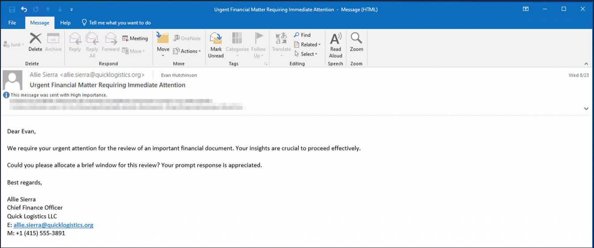
The email appeared questionable, but Evan still opened the attachment despite the scepticism. After opening the attached document and seeing that nothing happened, Evan reported the phishing email to the security team.

Upon receiving the phishing email report, the security team investigated the workstation of the CEO. During this activity, the team discovered the email attachment in the downloads folder of the victim.
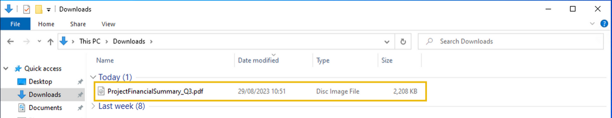

In addition, the security team also observed a file inside the ISO payload, as shown in the image below.
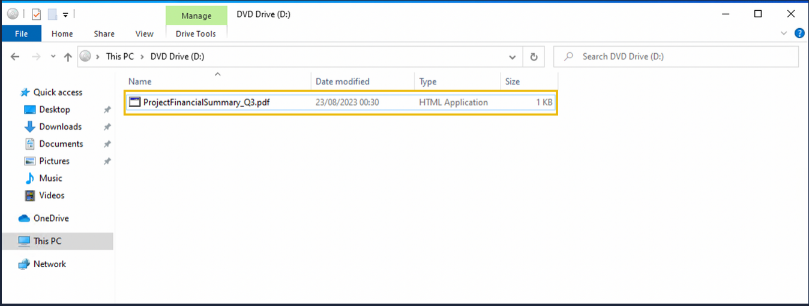

Lastly, it was presumed by the security team that the incident occurred between August 29 and August 30, 2023.
Given the initial findings, you are tasked to analyse and assess the impact of the compromise.

With that being said let's jump into questions.

**Question 1: What is the PID of the process that executed the initial stage 1 payload?**
After going into ELK home page and logging in with provided credentials i've set date range when incident happend. Next i queried for pdf file and found out what PID of the 1 stage payload was.
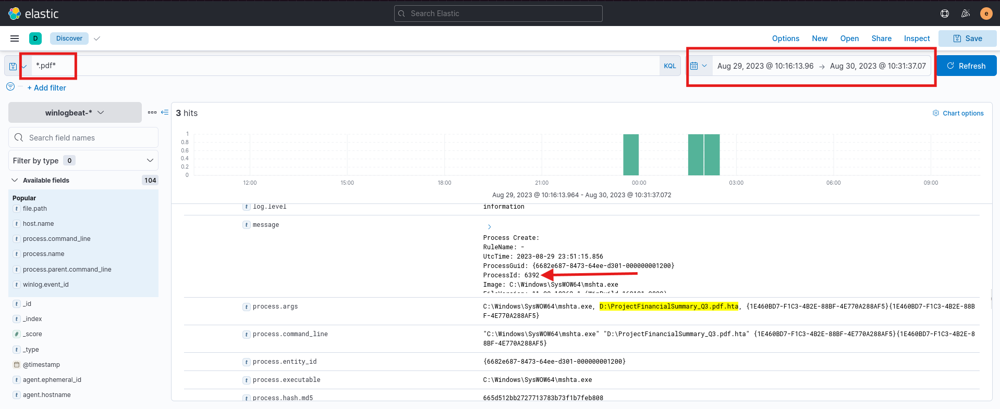
**Answer: 6392**

**Question 2: The stage 1 payload attempted to implant a file to another location. What is the full command-line value of this execution?**
After finding out malicious pdf file in the logs, i've added some fields necessary to further investigation. I've found out workstation name and username of the victim. And with all of that i've noticed command executed right after malicious file was executed.
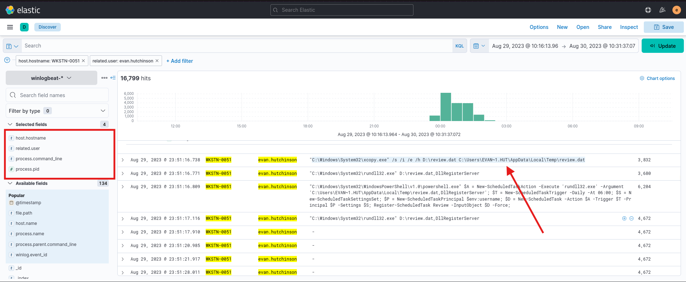
**Answer: "C:\Windows\System32\xcopy.exe" /s /i /e /h D:\review.dat C:\Users\Evan~1.HUT\AppData\Local\Temp\review.dat**

**Question 3: The implanted file was eventually used and executed by the stage 1 payload. What is the full command-line value of this execution?**
From the previously answered question i know that initial malicious file planted another file in different location. The new file is called review.dat. Knowing that and looking into logs i found another command executed by newly implanted file this time.
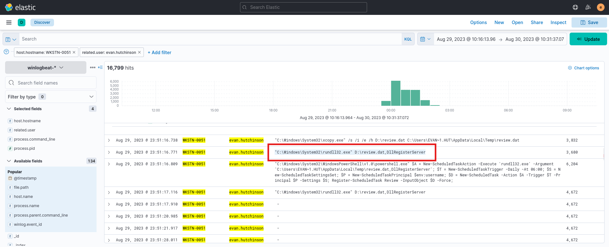
**Answer: "C:\Windows\System32\rundll32.exe" D:\review.dat,DllRegisterServer**

**Question 4: The stage 1 payload established a persistence mechanism. What is the name of the scheduled task created by the malicious script?**
First i've tried searching for *schtasks* but without success, and then i've typed *ScheduledTask* into query filed. There i found a powershell command used for scheduling new task and it's name.
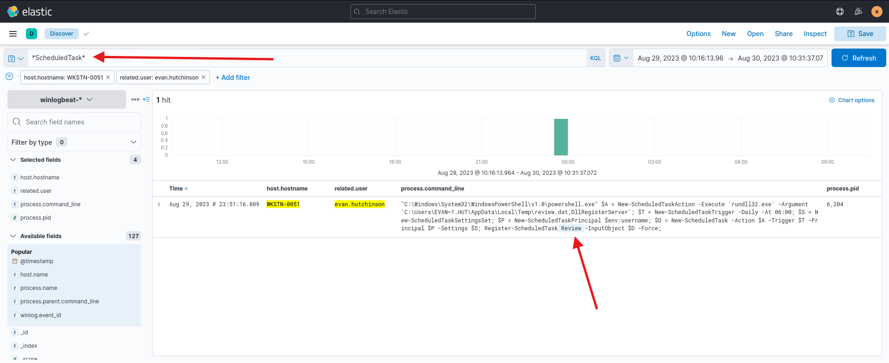
**Answer: Review**

**Question 5: The execution of the implanted file inside the machine has initiated a potential C2 connection. What is the IP and port used by this connection? (format: IP:port)**
I've added two more fields necessary for answering this question, i'm talking about *destination.ip* and *destination.port* fields. Going further through the logs since initial malicious file execution i've noticed that victims machine is connecting to a single ip. Which must be attacker ip address.
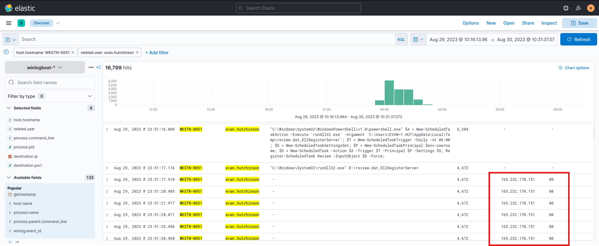
**Answer: 165.232.170.151:80**

**Question 6: The attacker has discovered that the current access is a local administrator. What is the name of the process used by the attacker to execute a UAC bypass?**

I googled UAC bypasses and found some common techniques used to do that. I've searched for them in Elastic, and got a hit.
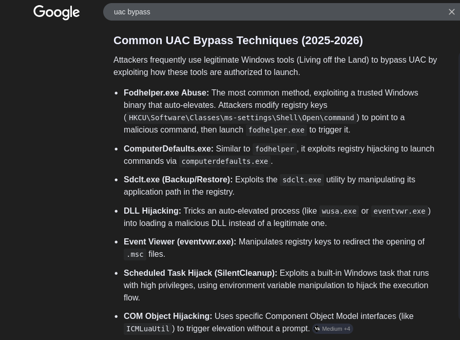
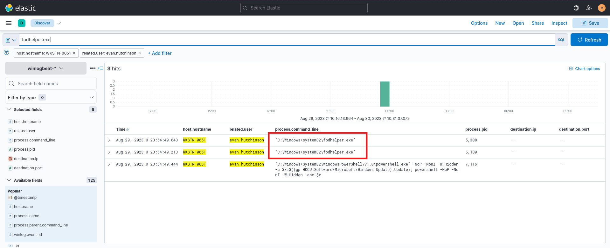
**Answer: fodhelper.exe**

**Question 7: Having a high privilege machine access, the attacker attempted to dump the credentials inside the machine. What is the GitHub link used by the attacker to download a tool for credential dumping?**
Simple search for github in the logs with wildcards on both sides as you can see on the screen. There in the logs i found tool used for credential dumping and it's called mimikatz.
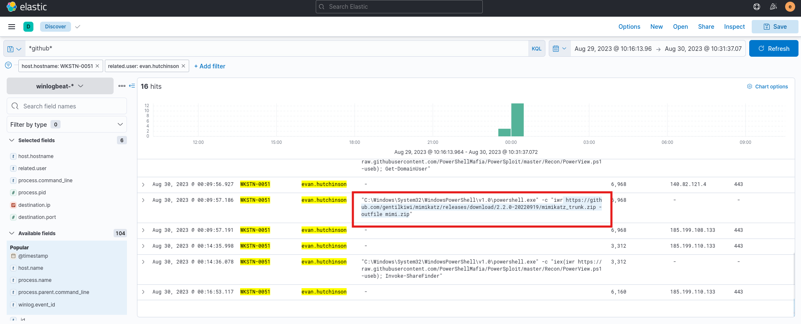
**Answer: https:\//github.com/gentilkiwi/mimikatz/releases/download/2.2.0-20220919/mimikatz_trunk.zip**

**Question 8: After successfully dumping the credentials inside the machine, the attacker used the credentials to gain access to another machine. What is the username and hash of the new credential pair? (format: username:hash)**
Simply i've searched for mimikatz execution and found the answer.
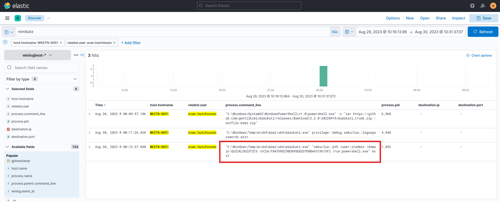
**Answer: itsadmin:F84769D250EB95EB2D7D8B4A1C5613F2**

**Question 9: Using the new credentials, the attacker attempted to enumerate accessible file shares. What is the name of the file accessed by the attacker from a remote share?**
Here knowing that file sharing on microsoft will be smb, i've tried to search for it in Elastic but without success. Then knowing that newly enumerated user was itadmin, i've tried to search for stuff related to IT specifically. And i've found the file:
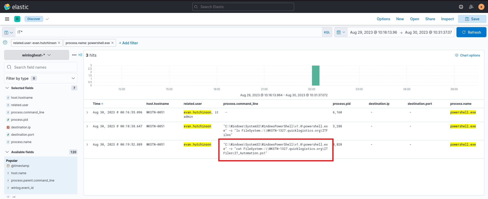
**Answer: IT_Automation.ps1**

**Question 10: After getting the contents of the remote file, the attacker used the new credentials to move laterally. What is the new set of credentials discovered by the attacker? (format: username:password)**
Going through logs i've searched for *session* to find out if i could find some commands where credentials are plaintext and i did it:
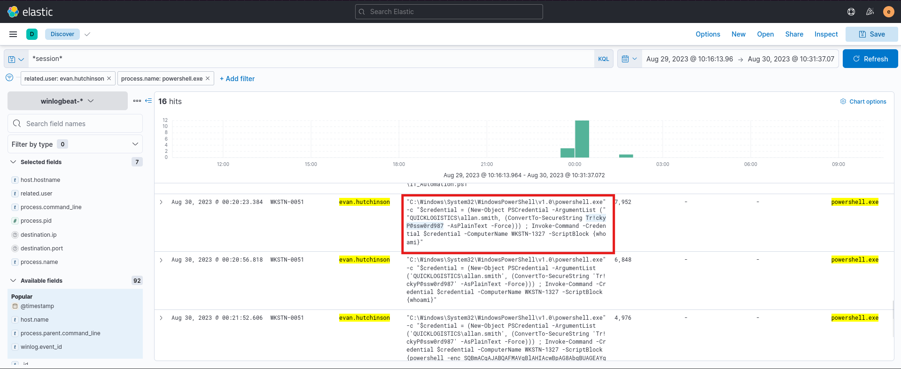
**Answer: QUICKLOGISTICS\allan.smith:Tr!ckyP@ssw0rd987**

**Question 11: What is the hostname of the attacker's target machine for its lateral movement attempt?**
From the same search done previously, i got workstation name.
**Answer: WKSTN-1327**

**Question 12: Using the malicious command executed by the attacker from the first machine to move laterally, what is the parent process name of the malicious command executed on the second compromised machine?**
Knowing that next machine targeted by the attacker was WKSTN-1327, i filtered for it and the first command ran on this machine has it's parent process wsmprovhost.exe which is the answer.
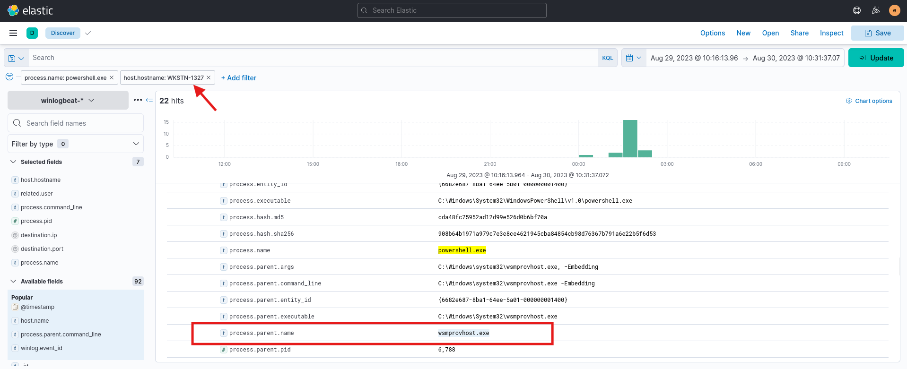
**Answer: wsmprovhost.exe**

**Question 13: The attacker then dumped the hashes in this second machine. What is the username and hash of the newly dumped credentials? (format: username:hash)**
While still looked into WKSTN-1327 i've searched for mimikatz again knowing that the attacker used it previously for credentials dump. And i got a hit.
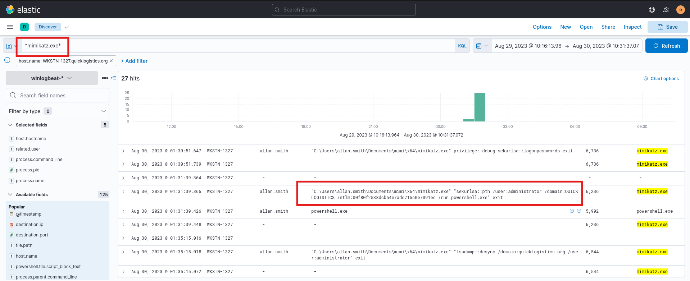
**Answer: administrator:00f80f2538dcb54e7adc715c0e7091ec**

**Question 14: After gaining access to the domain controller, the attacker attempted to dump the hashes via a DCSync attack. Aside from the administrator account, what account did the attacker dump?**
I've searched for *dcsync* in the search query and knowing that the attacker moves laterally between hosts, i've searched whole log file and i found that after finding credentials to administrator account, the attacker logged in and there used mimikatz.exe once again to dump even more and there another user was found.
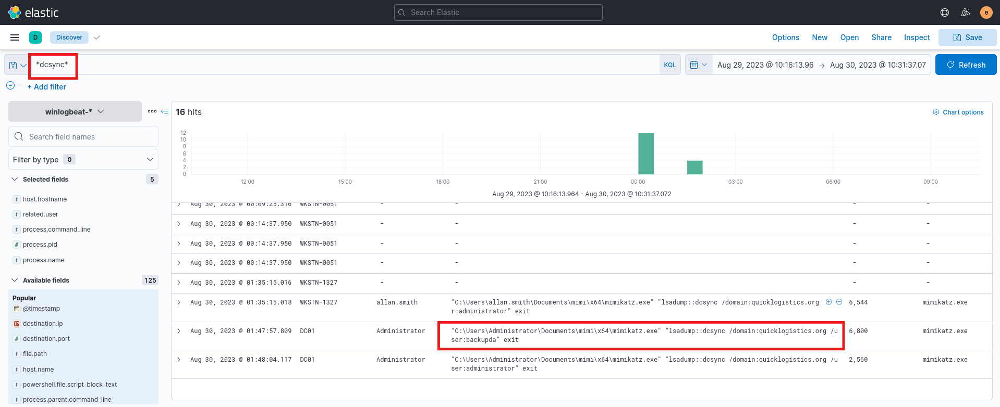
**Answer: backupda**

**Question 15: After dumping the hashes, the attacker attempted to download another remote file to execute ransomware. What is the link used by the attacker to download the ransomware binary?**
Knowing that the attacker was lastly seen on the Administrator machine going from there and knowing about his powershell usage from before, i've found the file. I sed alias for *Invoke-WebRequest* - *iwr* knowing that the attacker used it before.
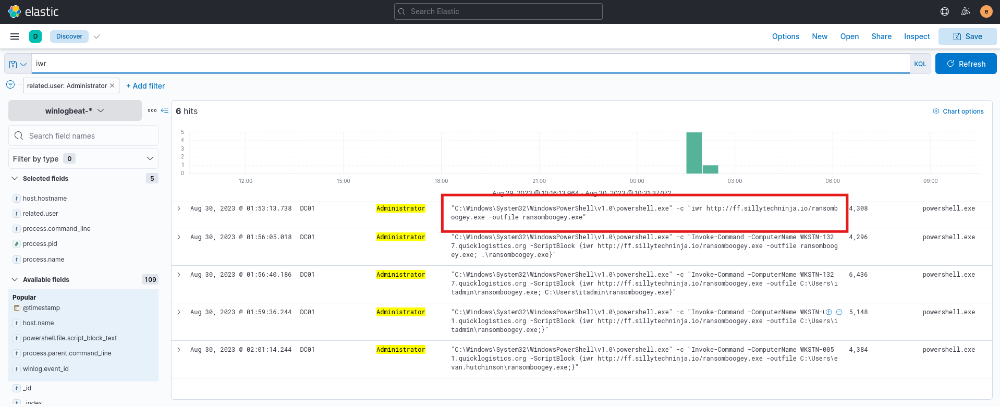
**Answer: http:\//ff.sillytechninja.io/ransomboogey.exe**

THE END
