Welcome in the write up of the Cowboy Bebop inspired CTF room on TryHackMe.com. If you're stuck by doing it by yourself, you can find answers needed in here.

Description:
*You were boasting on and on about your elite hacker skills in the bar and a few Bounty Hunters decided they'd take you up on claims! Prove your status is more than just a few glasses at the bar. I sense bell peppers & beef in your future!*

Let's begin!
I've deployed the machine, and I've ran nmap on it's IP address. I've done my standard command for CTF machines which is: *nmap -A -v -T4 -p- MACHINE_IP*. It was going for long time, I should ran it without scanning all ports (*-p-* flag). 
After scan is finished, I've got all open ports:

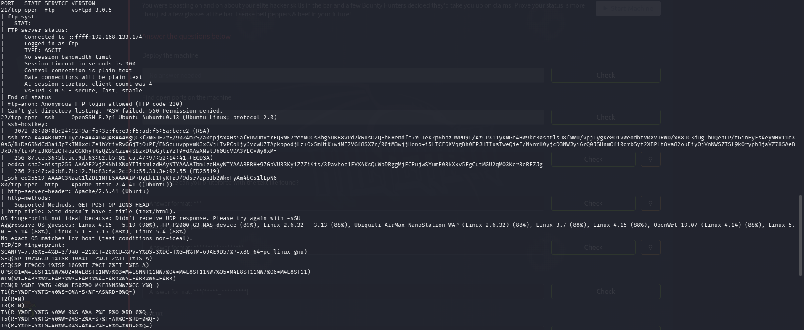

Now I can answer the first two questions. Which are just confirmation of deploying machine and scanning it.

**Question 3: Who wrote the task list?**
From nmap scan I know which ports are open: 21, 22 and 80. First of all I'll check what is in there. Nmap scans shows that *anonymous login is allowed*. Let's check it out!

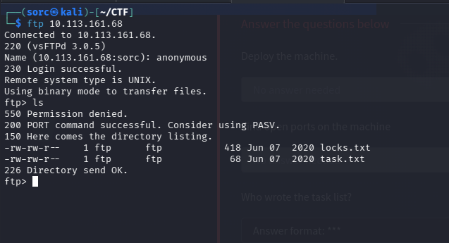

I've logged in as *anonymous* and I've found two files in there. I've downloaded them into my machine and checked what's inside.

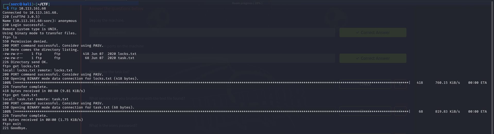

The first file: *locks.txt* contains bunch of strings, probably passwords, because they are readable. And in *task.txt* I've found a note:

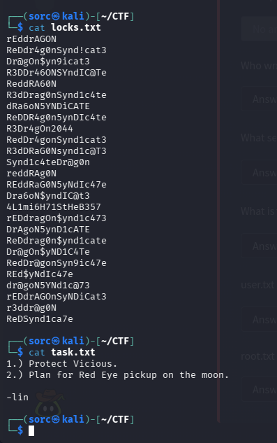

The note has been written by **lin**.
**Answer: lin**

**Question 4: What service can you bruteforce with the text file found?**
So there are three ports opened on the machine, I went into ftp already, there is also http, and ssh. So bruteforce is needed probably for ssh. Which is correct question.
**Answer: ssh**

**Question 5: What is the users password?**
Now it's time for bruteforcing. I'm gonna use tool called hydra to do that. 
The command that I've used: *hydra -l lin -P locks.txt ssh:\//MACHINE_IP*. 
And I've found the password:

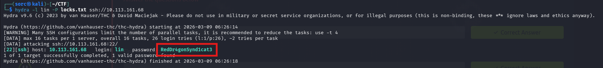

**Answer: RedDr4gonSynd1cat3**

**Question 6: user.txt**
Now I'm gonna log in with previously found credentials.

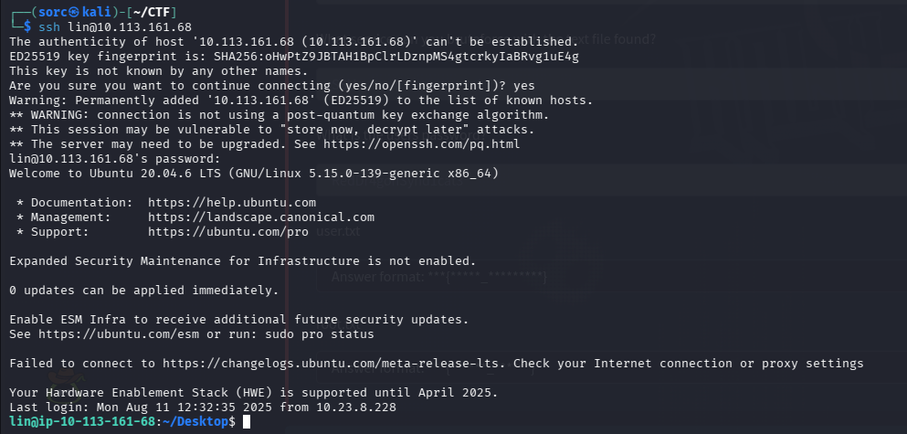

Now, when I'm inside the machine, I need to find *user.txt* file.
And it's right in the directory I've just landed after logging in.

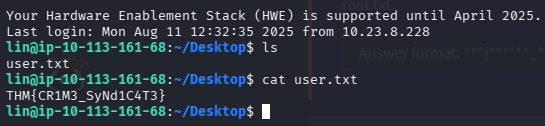

**Answer: THM{CR1M3_SyNd1C4T3}**

**Question 7: root.txt**
Now it's time for privilege escalation. First I've checked what commands can I ran as root, with *sudo -l* command. And I've found that user *lin* can run */bin/tar* as root. 

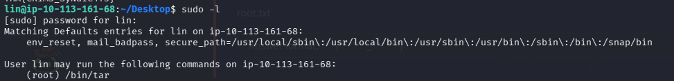

So I've checked gtfobins.org if there is a way to escalate privileges with it.
And there it was:

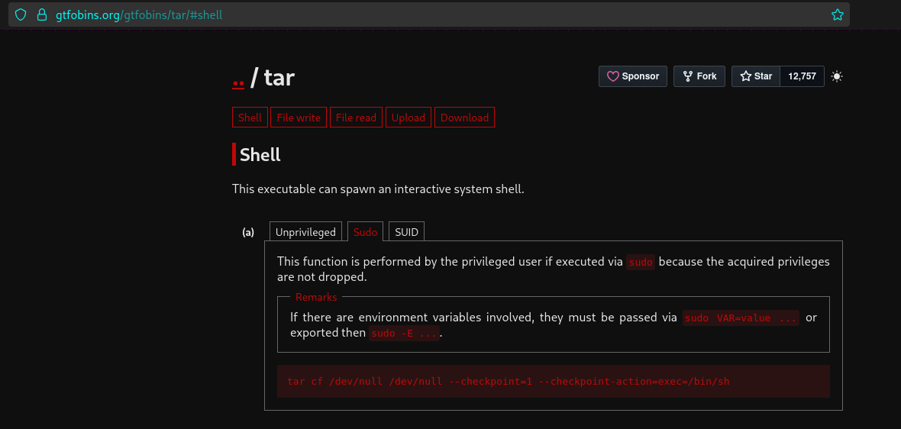

So I've used command: *sudo /bin/tar -cf /dev/null /dev/null --checkpoint=1 --checkpoint-action=exec=/bin/sh*.
And it worked! First try!

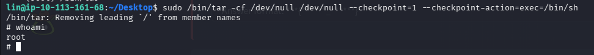

Then I navigated straight to */root* directory where were the file *root.txt*.

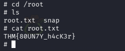

And I've got root flag!
**Answer: THM{80UN7Y_h4cK3r}**

