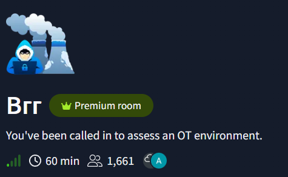
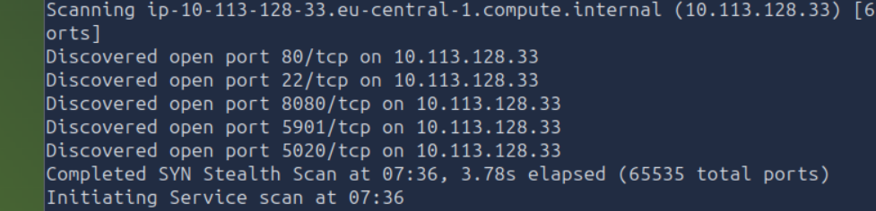
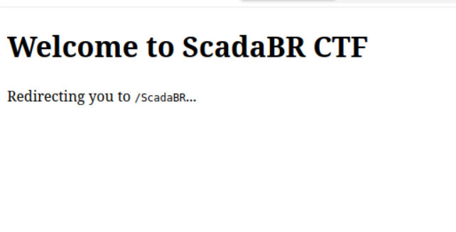
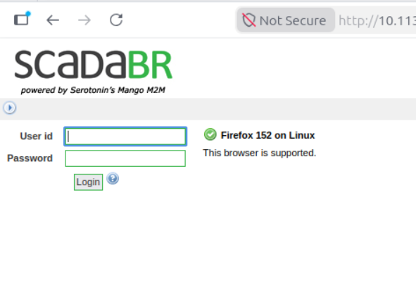
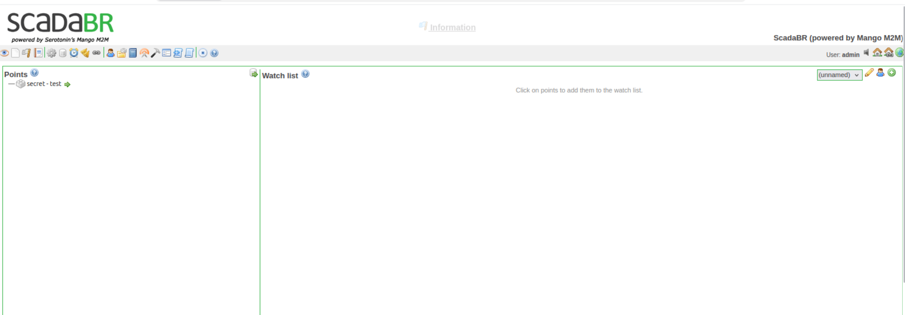
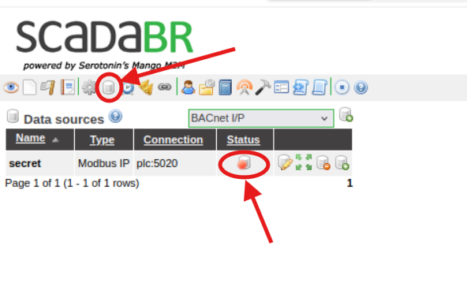
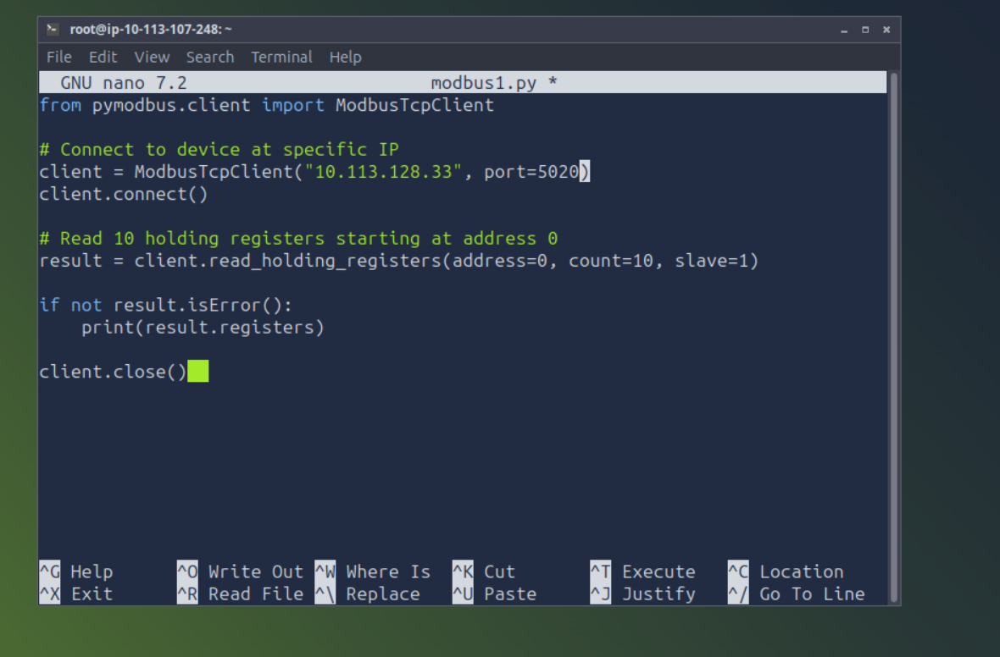
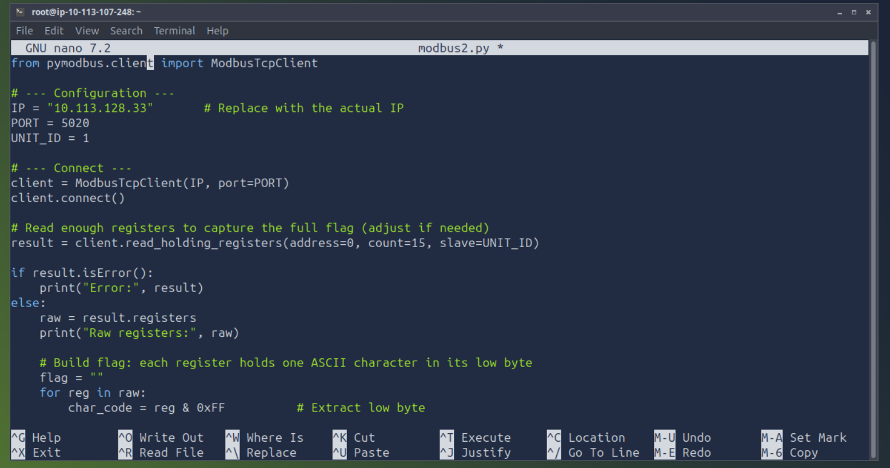
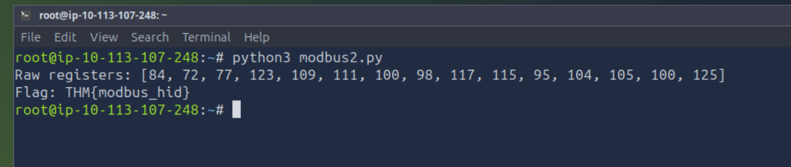

Write up for THM CTF "Brr".
In this one I will be dealing with OT environment which means Operational Technology. So, it will be some kind of industrial system, using SCADA.

After booting up a machine, first thing to do is nmap scan with a command:
`nmap -A -p- -T4 -v TARGET_IP`

I discovered that ports 80, 22, 8080, 5901, 5020 are opened.

Knowing that port 8080 is frequently used for http connections I went to the browser. And there was a website:

And redirect to the ScadaBR login page:

On the login for I tried default credentials `admin:admin`, and it worked straight away. First try.

As I was going through the panel, figuring out what it is and what particular things does. I clicked on "Data Sources" and found that there is a single data source named *secret* which runs on port 5020 and uses Modbus IP. Modbus IP is an industrial communication protocol that allows devices to exchange data.
But it was disabled, so I clicked red dot in the status column to enable it.

Now, I need to extract data from it. To do that I need a python script, but first I need to install *pymodbus.client* library.
To do that I ran command:
`pip3 install pymodbus`

Next, I asked AI how to communicate with a Modbus IP with *pymodbus library* and it gave me a simple script:

And I ran it with `python3 modbus1.py` command.
It gave me numbered output. But the script read only first 10 registers. Next, I tried to figuring out how many registers there are by changing `count` value in the script. I found out that there is 15 registers. Next thing is to extract every register value and translate it to the letter. So, I went to AI agent and it gave me another python script, which does exactly that.

And after running it, I got a flag for this challenge.

Happy hacking!
The scripts used in this challenge are available in the scripts directory. Enjoy!