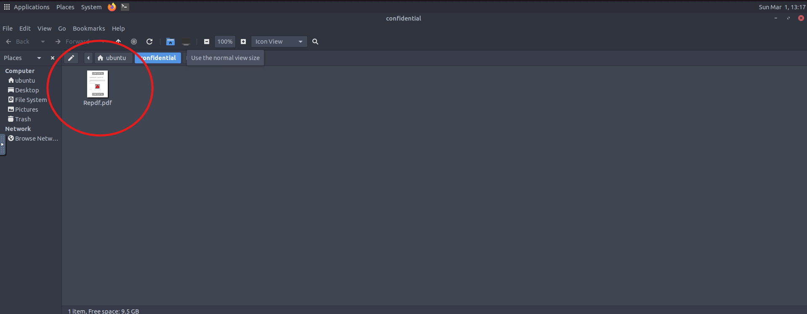
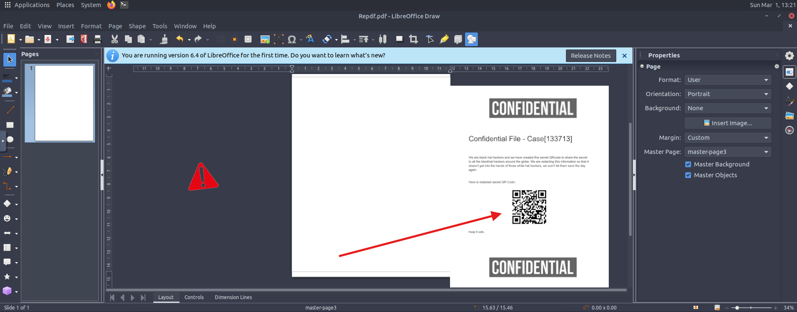
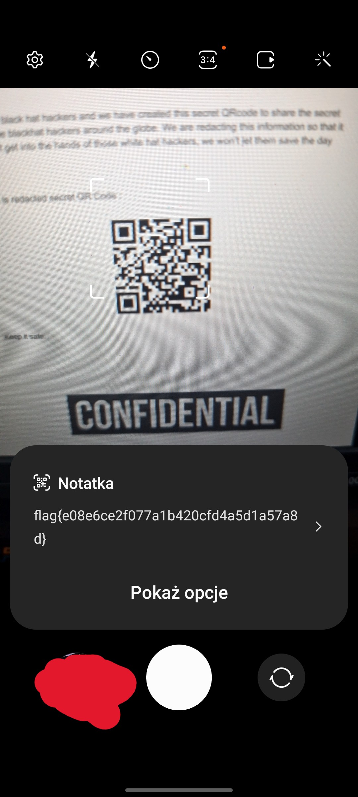

This is a writeup for tryhackme CTF called Confidential. If you're stuck and need help, you found great place. 
Let's begin.

Room description:
*We got our hands on a confidential case file from some self-declared "black hat hackers"... it looks like they have a secret invite code available within a QR code, but it's covered by some image in this SPF! If we want to thwart whatever it is they are planning, we need your help to uncover what that QR code says!*

*The file you need is located in **/home/ubuntu/confidential** on the VM.*

After booting up VM I was greeted with a sighting of opened folder with a pdf file in it.

After opening it in LibreOffice my first thought was to move it around. That's how i uncovered the QR code.

Next i took my phone, opened camera and scanned it.
And i found the flag! Pretty simple challenge.

**Answer: flag{e08e6ce2f077a1b420cfd4a5d1a57a8d}**

That's it!